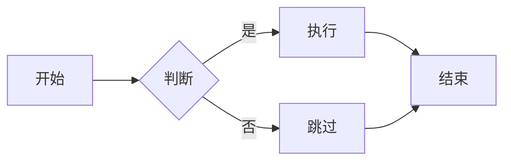
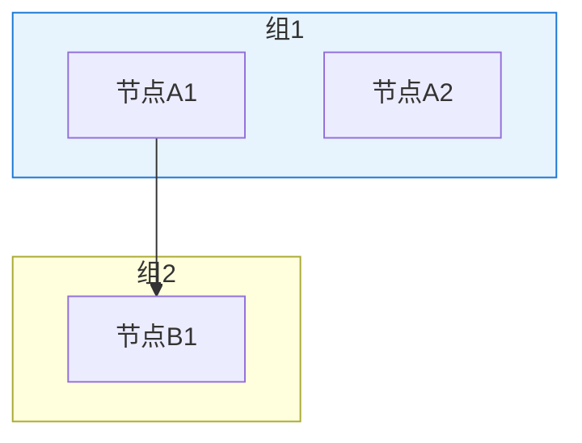

# 项目报告编写流程

从远程仓库阅读到技术报告发布的完整工作流程。

## 适用场景

- 将 GitHub 项目转化为个人项目集展示
- 为现有项目添加技术文档
- 编写求职/作品集类技术报告

---

## 成功模式概览

```
┌─────────────────────────────────────────────────────────────────┐
│                    项目报告编写流程                              │
├─────────────────────────────────────────────────────────────────┤
│                                                                 │
│  阶段1: 信息收集            阶段2: 需求对齐                      │
│  ├─ 阅读远程仓库 README    ├─ 明确报告用途                       │
│  ├─ 理解项目架构          ├─ 确定目标读者                       │
│  └─ 提取关键信息          └─ 选择内容形式                       │
│                                                                 │
│  阶段3: 内容创作            阶段4: 可视化增强                      │
│  ├─ 编写初稿              ├─ 选择图表方案                       │
│  ├─ 迭代优化              ├─ 配置渲染环境                       │
│  └─ 用户反馈修订          └─ 替换代码图表                       │
│                                                                 │
└─────────────────────────────────────────────────────────────────┘
```

---

## 阶段1: 信息收集

### 1.1 阅读远程仓库

使用 `mcp__web_reader__webReader` 工具获取项目 README：

```
工具: mcp__web_reader__webReader
参数: url = "https://github.com/用户名/项目名"
```

**要点**：
- 优先获取 README.md 内容
- 记录项目结构、核心功能、技术栈
- 识别项目间的依赖关系

### 1.2 理解项目架构

根据 README 内容绘制心智模型：

| 要素 | 关注点 |
|------|--------|
| **核心功能** | 项目解决了什么问题 |
| **技术栈** | 使用了哪些关键技术 |
| **模块划分** | 各组件的职责边界 |
| **通信方式** | 组件间如何交互 |

### 1.3 提取关键信息

建立信息清单：

```markdown
- 项目名称
- 项目简介（1-2句话）
- 核心仓库列表
- 技术栈清单
- 架构关系
- 关键技术亮点
```

---

## 阶段2: 需求对齐

### 2.1 明确报告用途

| 用途 | 特点 | 写作策略 |
|------|------|---------|
| **求职展示** | 突出技术亮点和个人贡献 | 强调技术深度、解决的问题 |
| **学术汇报** | 需要方法论和实验数据 | 详细说明技术背景、评测方法 |
| **项目文档** | 面向潜在用户/贡献者 | 清晰的使用指南、API 说明 |
| **技术分享** | 面向开发者同行 | 深入实现细节、经验教训 |

### 2.2 确定内容形式

参考现有项目文档格式，保持一致性：

```bash
# 查看现有项目文档
ls src/content/projects/
cat src/content/projects/示例项目.md
```

**典型 Frontmatter 格式**：

```yaml
---
title: 项目标题
description: 一句话简介
pubDate: YYYY-MM-DD
heroImage: ../../assets/图片.png  # 可选
repo: https://github.com/xxx/xxx  # 可选
tags: ['标签1', '标签2']
---
```

### 2.3 命名沟通确认

使用 `AskUserQuestion` 确认关键决策：

```
问题: "报告的主要用途是什么？"
选项: 求职展示 / 学术汇报 / 项目文档 / 技术分享
```

---

## 阶段3: 内容创作

### 3.1 文档结构模板

```markdown
---
title: 项目标题
description: 一句话简介
pubDate: YYYY-MM-DD
repo: GitHub链接
tags: ['标签列表']
---

## 项目简介
（1-2段概述，说明项目目标、核心仓库）

## 系统架构
（Mermaid 架构图 + 说明文字）

## 核心模块
### 模块1
（功能说明 + 技术选型）

### 模块2
（功能说明 + 技术选型）

## 关键技术亮点
### 1. 技术点A
### 2. 技术点B

## 项目结构
（目录树展示）

## 相关文档
（GitHub链接、参考文档）
```

### 3.2 编写原则

| 原则 | 说明 |
|------|------|
| **KISS** | 避免过度技术化，用清晰语言解释 |
| **受众导向** | 根据读者调整深度和广度 |
| **突出亮点** | 每个项目提炼3-5个技术亮点 |
| **可验证性** | 提供链接让读者可深入了解 |

### 3.3 迭代优化

根据用户反馈修订：

1. 技术准确性修正
2. 结构调整
3. 补充遗漏要点

---

## 阶段4: 可视化增强

### 4.1 图表方案选择

| 方案 | 优点 | 缺点 | 适用场景 |
|------|------|------|---------|
| **Mermaid.js** | 代码即图、易维护、版本控制友好 | 图表样式相对固定 | 技术文档、架构图 |
| **Excalidraw** | 手绘风格美观、直观 | 需要手动绘制 | 演讲、展示 |
| **draw.io** | 功能强大、专业 | 手动绘制、不便维护 | 正式文档、发布 |

**推荐**：技术文档首选 Mermaid

### 4.2 Mermaid 渲染方案

#### 方案A: Astro 插件（仅兼容 Astro 4-5）

```bash
pnpm add astro-mermaid
```

```js
// astro.config.mjs
import mermaid from 'astro-mermaid';
export default defineConfig({
  integrations: [mermaid()],
});
```

#### 方案B: 客户端 CDN 渲染（推荐，兼容性好）

在页面模板中添加脚本：

```html
<script>
  async function initMermaid() {
    const blocks = document.querySelectorAll('pre code.language-mermaid');
    if (blocks.length === 0) return;

    const script = document.createElement('script');
    script.src = 'https://cdn.jsdelivr.net/npm/mermaid@10/dist/mermaid.min.js';
    script.onload = () => {
      mermaid.initialize({ startOnLoad: false, theme: 'neutral' });
      blocks.forEach(async (block, i) => {
        const { svg } = await mermaid.render(`mermaid-${i}`, block.textContent);
        block.parentElement.replaceWith(/* wrapper with svg */);
      });
    };
    document.head.appendChild(script);
  }
  document.addEventListener('DOMContentLoaded', initMermaid);
</script>
```

### 4.3 Mermaid 语法速查

#### 流程图 (flowchart)



#### 分组图



---

## 关键决策点记录

### 本次任务决策

| 决策点 | 选项 | 选择 | 理由 |
|--------|------|------|------|
| 报告用途 | 求职/学术/文档/分享 | **求职展示** | 面向HR和面试官，突出技术能力 |

### 2025-03-15: AI Agent 服务框架 (agent-gaia-base)

| 决策点 | 选项 | 选择 | 理由 |
|--------|------|------|------|
| 报告用途 | 求职/学术/文档/分享 | **求职展示** | 作品集展示，面向HR和面试官 |
| 项目角色 | 独立开发/核心贡献/二次开发 | **独立开发者** | 完全自主设计并实现 |
| 技术深度 | 详细底层/模块概述 | **模块概述** | 初版项目，简洁展示架构设计 |
| 图表方案 | Mermaid/Excalidraw/draw.io | **Mermaid** | 代码即图，易维护 |
| 内容策略 | 全面深入/简洁模块化 | **简洁模块化** | 作品集风格，不过于底层 |
| 图表方案 | Mermaid/Excalidraw/draw.io | **Mermaid** | 代码即图，易维护，版本控制友好 |
| 渲染方式 | 插件/客户端/服务端 | **客户端CDN** | Astro 6.0 兼容性问题，客户端最稳定 |
| 标题策略 | 具体工具名/通用描述 | **通用描述** | "RAG系统"比"Dify RAG"更通用 |

---

## 常见问题与解决

### Q1: Mermaid 插件与 Astro 版本不兼容

**问题**：`astro-mermaid` 只支持 Astro 4-5，Astro 6.0 会报错

**解决**：使用客户端 CDN 渲染方案

### Q2: 构建后图表不显示

**问题**：Mermaid 代码块显示为原始代码

**排查**：
1. 检查 `<script>` 是否正确引入
2. 检查代码块语言标识是否为 `language-mermaid`
3. 浏览器控制台是否有错误

### Q3: 用户反馈内容不准确

**问题**：技术描述与实际项目不符

**解决**：
1. 回溯原始 README 资料
2. 必要时直接访问 GitHub 仓库验证
3. 与用户确认后再修改


| 维度 | 标准 |
|------|------|
| **准确性** | 技术描述与原项目一致 |
| **可读性** | 结构清晰，分段合理 |
| **完整性** | 覆盖核心功能和亮点 |
| **专业性** | 术语使用正确，格式统一 |

---

## 资源链接

- [Mermaid 官方文档](https://mermaid.js.org/)
- [Astro Content Collections](https://docs.astro.build/en/guides/content-collections/)
- [Markdown 语法指南](https://www.markdownguide.org/)
