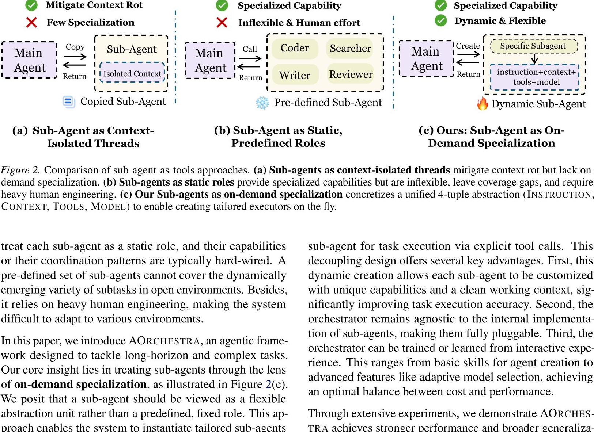
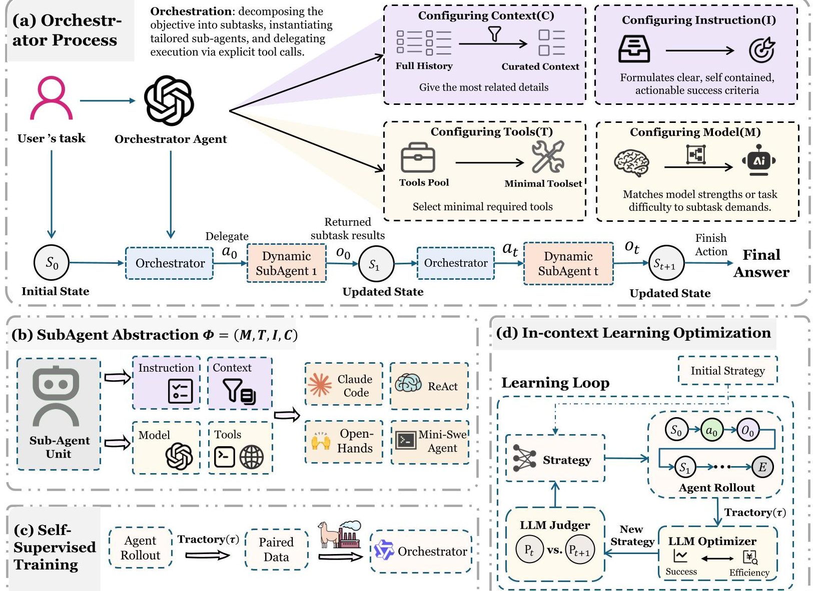
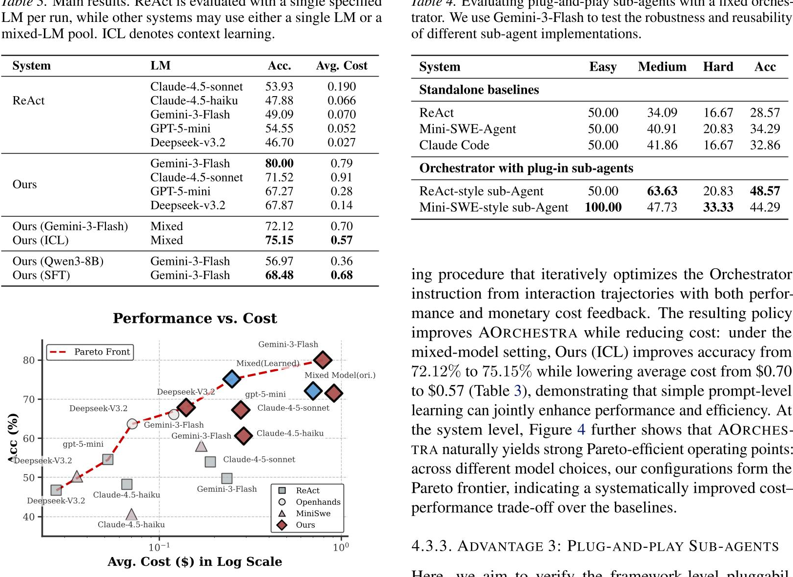
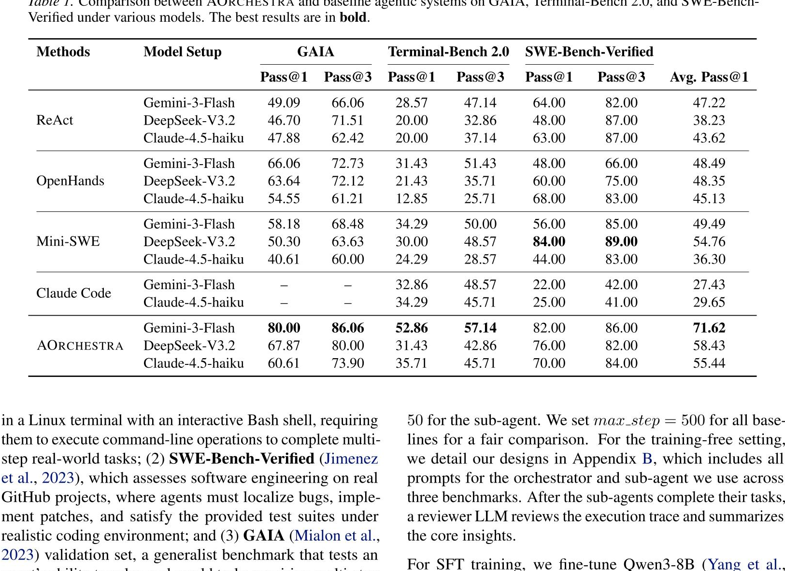
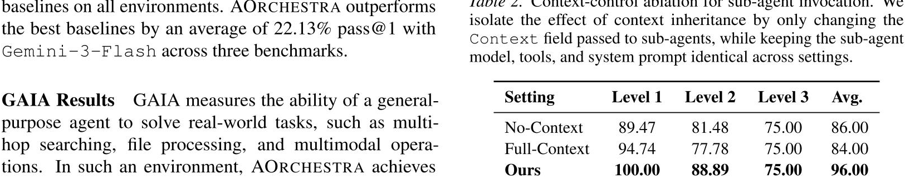
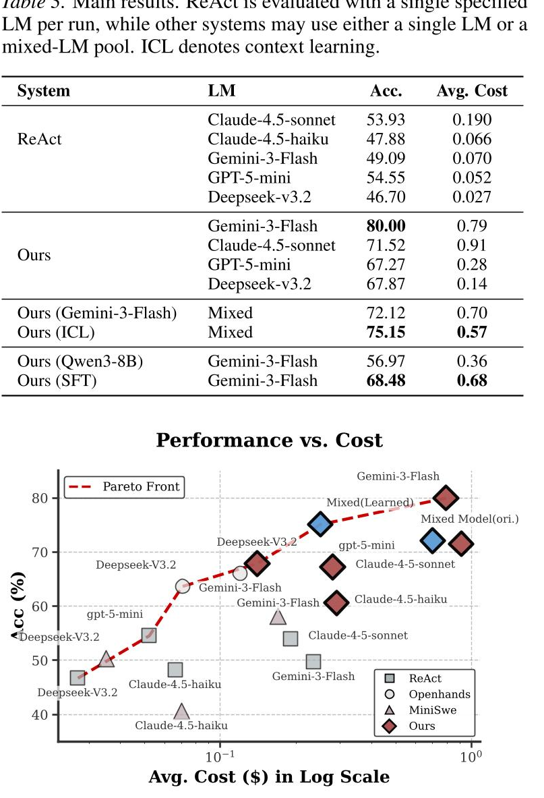
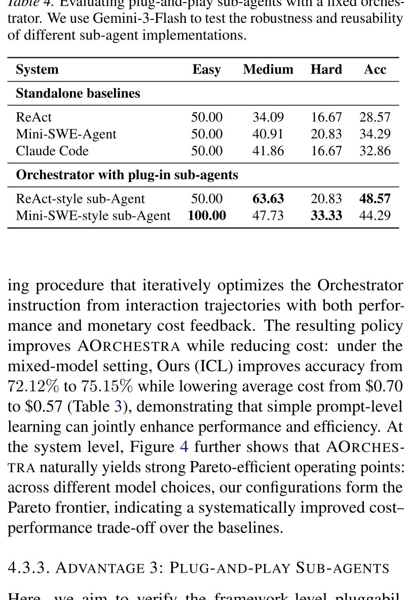

## 项目简介

本文是对 **AORCHESTRA** 智能体编排系统的深度解析。这是一个革命性的多智能体协作框架，通过**动态生成子智能体**的泛化架构，在多个基准测试中展现出超越专用系统的强悍性能。

## 核心亮点

在搭配 Gemini-3-Flash 模型时，AORCHESTRA 展现出了压倒性的优势：

| 基准测试 | AORCHESTRA | 传统 ReAct | OpenHands |
|---------|-----------|-----------|-----------|
| **SWE-Bench-Verified** (代码工程) | **82.00%** | 64% | 48% |
| **GAIA** (通用复杂任务) | **80.00%** | - | 66.06% |
| **Terminal Bench** (终端操作) | **52.86%** | - | - |

这证明了"动态生成智能体"这种泛化架构，居然比专门为特定任务定制的系统还要强悍！

## 架构演进：子智能体范式的三大阶段

### (a) 作为上下文隔离线程的子智能体

像开了一个新窗口，避免了主窗口的信息过载，但缺乏专业能力。

### (b) 作为静态预定义角色的子智能体

像公司里有固定的"程序员"、"搜索员"。虽然有专业能力，但太死板，难以应对现实新问题。

### (c) AORCHESTRA：按需专业化的动态子智能体

主智能体直接凭空创造一个专属员工！通过赋予特定的 **(指令 + 上下文 + 工具 + 模型)**，完美兼顾纯净上下文和极强专业性。

## 系统架构：四元组的魔法

Orchestrator 不亲自干活，只负责配置 **四元组** Φ = ⟨I, C, T, M⟩：

| 元素 | 含义 | 作用 |
|-----|------|-----|
| **I** | 指令 (Instruction) | 定义子智能体的任务目标 |
| **C** | 精简上下文 (Context) | 投喂精确的"切片记忆" |
| **T** | 最小工具集 (Tools) | 按需分配必要工具 |
| **M** | 最优模型 (Model) | 选择性价比最高的模型 |

系统还是**可学习的**（下图所示），能随着经验积累越来越聪明。

## 性能与成本：帕累托前沿

通过让编排器动态选择模型（Model Routing），AORCHESTRA 形成了一条完美的"帕累托前沿"。特别是 **Mixed(Learned)** 策略，让大模型自己学习"何时抠门，何时下血本"，整体性价比达到极致。

## 跨模型普适性验证

**最不可思议的发现**：即使 AORCHESTRA 搭配体量较小的 Claude-4.5-haiku，在 GAIA 上的准确率也达到了 60.61%，居然击败了使用顶级模型 Gemini-3-Flash 的大多数基准框架（比如 ReAct 只有 49.09%）！

> **结论**：好的管理（编排架构）比单纯堆砌聪明的大脑（模型参数）更重要！

## 上下文控制：信息给太多反而变笨

| 任务复杂度 | 全量上下文 | 提取上下文 (Ours) |
|-----------|-----------|------------------|
| Level 1 (简单) | 94.74% | **100%** |
| Level 3 (复杂) | 75.00% | **75.00%** |
| **均值** | 84.00% | **96.00%** |

**核心洞察**：人类总以为给 AI 的信息越多越好，实验无情地打破了这个迷思。在复杂长线任务中，"未经过滤的全量记忆"是毒药，精确投喂的"切片记忆"才是解药！

## 可学习性：当老板是一门可以快速学会的技能

**惊人发现**：

- 把主编排器换成很小的开源模型 **Qwen3-8B**，准确率 56.97%，依然高于使用顶级模型但不做复杂编排的 ReAct 系统 (49.09%)！
- 仅仅对这个 8B 小模型进行一点微调 (Ours SFT)，准确率瞬间飙升到 **68.48%**！

这说明"如何拆解任务、如何分配上下文、如何调用工具"这种编排能力，非常容易被模型内化学习。

## 即插即用：海纳百川的终极包容性

AORCHESTRA 并没有把子智能体的底层逻辑写死！你可以把现成开源的 ReAct 智能体或者 Mini-SWE 智能体直接"当成一个零件"塞进四元组里。

**结果**：一旦被编排器接管，这些老旧智能体的性能平均跃升了 **10~20 个百分点**！这是一个真正的"元框架 (Meta-Framework)"。

## 核心结论

1. **动态专业化**：通过四元组按需生成子智能体，兼顾上下文纯净度和专业能力
2. **架构压制模型**：优秀的编排架构能让小模型击败大模型
3. **上下文精炼**：精确的"切片记忆"优于"全量记忆"
4. **可学习性**：编排能力可以被模型快速内化
5. **即插即用**：现有智能体可直接作为子组件获得性能提升

## 参考文献

- [论文原文 (arXiv)](https://arxiv.org/abs/2602.03786)
- [官方代码仓库 (GitHub)](https://github.com/FoundationAgents/AOrchestra)
- [HuggingFace Paper](https://huggingface.co/papers/2602.03786)
