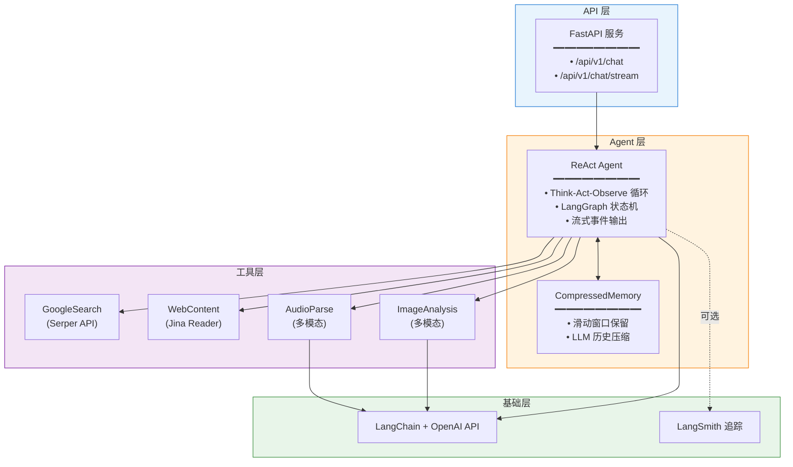
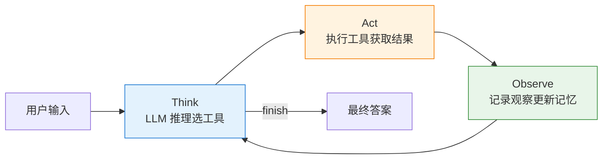
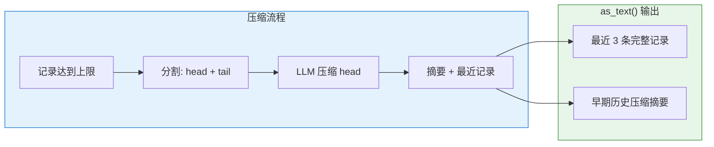

## 项目简介

本项目是一个 **基于 LangGraph 的 AI Agent 服务框架**，实现了经典的 **ReAct (Reasoning + Acting)** 模式。Agent 通过「思考 → 行动 → 观察」循环自主规划，调用工具获取信息，最终完成任务。

**核心特性**：
- **ReAct Agent** - 思考-行动-观察循环，自动选择工具完成任务
- **流式输出** - SSE 实时返回执行过程，支持前端展示
- **多种工具** - Google 搜索、网页抓取、图像分析、音频解析
- **记忆功能** - LLM 智能压缩历史对话，保持长对话上下文

## 系统架构



**分层设计**：

| 层级 | 职责 | 核心组件 |
|------|------|---------|
| API 层 | HTTP 接口、流式响应 | FastAPI |
| Agent 层 | 推理规划、记忆管理 | ReAct Agent, CompressedMemory |
| 工具层 | 外部能力集成 | 搜索、网页、图像、音频 |
| 基础层 | LLM 调用、链路追踪 | LangChain, LangSmith |

## 核心模块

### 1. ReAct Agent

Agent 采用 **Think → Act → Observe** 循环模式：



**执行流程**：
1. **Think** - LLM 根据当前观察和记忆，选择下一步动作（工具调用或 finish）
2. **Act** - 执行工具调用，获取结果（支持重试机制）
3. **Observe** - 记录本轮观察，更新压缩记忆

### 2. 工具系统

| 工具 | 功能 | 底层服务 |
|------|------|---------|
| `google_search` | Google 搜索，返回摘要 | Serper API |
| `web_content` | 提取网页内容并问答 | Jina Reader + LLM |
| `image_analysis` | 图像内容分析 | 多模态 LLM |
| `audio_parse` | 音频转录与问答 | 多模态 LLM |

工具采用 **泛型基类 + 注册中心** 设计，自动生成 JSON Schema，无缝转换为 LangChain 工具格式。

### 3. Memory 压缩机制

采用 **LLM 智能压缩 + 滑动窗口** 策略管理长对话上下文：



| 参数 | 默认值 | 说明 |
|------|--------|------|
| `max_memory` | 10 | 最大完整记录数 |
| `keep_recent` | 3 | 保留最近的条数（不压缩） |

### 4. API 服务

提供同步和流式两种调用方式：

**同步调用** `/api/v1/chat`：

```bash
curl -X POST http://localhost:8000/api/v1/chat \
  -d '{"message": "搜索 LangGraph 是什么"}'
```

**流式调用** `/api/v1/chat/stream` (SSE)：

```
data: {"event": "think", "data": {...}, "step": 1}
data: {"event": "act", "data": {...}, "step": 2}
data: {"event": "observe", "data": {...}, "step": 3}
data: {"event": "finish", "data": {"answer": "..."}, "step": 4}
```

流式输出支持前端实时展示 Agent 执行过程。

## 技术栈

| 层级 | 技术 | 用途 |
|------|------|------|
| **Agent 框架** | LangGraph | 状态机编排 |
| **LLM 集成** | LangChain + OpenAI API | 大语言模型调用 |
| **Web 框架** | FastAPI + Uvicorn | REST API 服务 |
| **流式输出** | SSE (Server-Sent Events) | 实时事件推送 |
| **配置管理** | Pydantic Settings | 环境变量 + .env |
| **追踪调试** | LangSmith (可选) | 链路追踪 |
| **包管理** | uv + pyproject.toml | 依赖管理 |

## 项目结构

```
src/ai_agent/
├── agents/                 # Agent 实现
│   ├── base.py            # Agent 基类
│   └── react/             # ReAct Agent
│       ├── graph.py       # LangGraph 状态机
│       └── events.py      # 事件类型
│
├── tools/                  # 工具系统
│   ├── base.py            # 泛型基类
│   ├── registry.py        # 注册中心
│   ├── web/               # Web 工具
│   └── media/             # 媒体工具
│
├── memory/                 # 记忆系统
│   └── base.py            # CompressedMemory
│
├── llm/                    # LLM 客户端
│   ├── client.py          # 工厂方法
│   └── config.py          # 配置管理
│
├── api/                    # API 层
│   ├── main.py            # FastAPI 应用
│   └── routes/chat.py     # 聊天路由
│
└── types/                  # 类型定义
    ├── agents.py          # AgentEvent
    └── tools.py           # ToolResult
```

## 关键技术亮点

### 1. ReAct 模式实现
- Think-Act-Observe 循环自主规划
- 结构化 JSON 输出确保可解析性
- 多层 JSON 修复兜底（兼容国产模型）

### 2. LangGraph 状态机编排
- 声明式节点与边定义
- 条件路由与循环支持
- 可视化调试能力

### 3. 工具系统设计
- 泛型基类确保类型安全
- 自动生成 JSON Schema
- 无缝转换为 LangChain 工具格式

### 4. LLM 压缩记忆
- 滑动窗口保留最近上下文
- LLM 智能压缩早期历史
- 持久化关键事实与策略

### 5. 流式事件输出
- SSE 实时推送执行过程
- 细粒度事件类型（think/act/observe/finish）
- 前端可展示 Agent 推理过程

## 相关文档

- [GitHub: agent-gaia-base](https://github.com/pheonix2006/agent-gaia-base)
- [LangGraph 官方文档](https://github.com/langchain-ai/langgraph)
- [LangChain 文档](https://python.langchain.com/)
