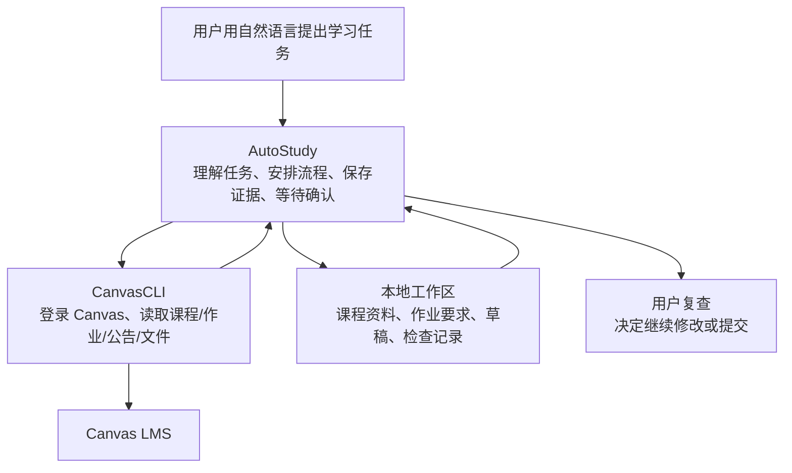

## 项目简介

**AutoStudy** 是我在 DeepWisdom 实习期间做的一套本地 Canvas 学业助手。它运行在 Claude Code / Codex 这类本地 coding agent 里，负责帮用户处理课程资料、作业要求、草稿生成和提交前检查。

用户用自然语言提出需求，比如“看看这周有什么作业”“同步这门课的课件”“把这些 lecture 写成复习笔记”“帮我处理这个作业”。AutoStudy 会连接 Canvas，读取课程和作业信息，把相关材料整理到本地，并在关键步骤停下来让用户确认。

这个项目来自我和 mentor 的一次讨论：既然 Codex / Claude Code 已经能读文件、跑命令、处理长任务，能不能把 Canvas 学习流程也变成一套稳定的本地 skills？我后面主要负责把这个想法落地，包括 Canvas 数据工具、学习任务流程、作业侦查、用户确认、本地草稿生成和验证。

我不会在这里公开真实课程号、作业名、数据集或作业产物。这个项目确实通过多个真实 Canvas 课程任务反复验证过，但作品页只保留抽象后的流程和工程设计。

## 为什么需要它

Canvas 上的学习信息经常很分散。作业标题在一个页面，要求可能藏在评分标准、课程模块、课件 PDF、公告、syllabus 或外部链接里。直接把标题丢给 LLM，很容易生成一份看起来完整、但漏掉关键要求的草稿。

我希望 AutoStudy 先把学习流程管住，再去生成内容：

- 先知道 Canvas 上现在有什么课、什么作业、什么公告；
- 把课件、阅读材料和课程结构同步到本地，方便之后复习和引用；
- 写作业前先查清要求来自哪里，而不是从标题开始猜；
- 对开放式任务先问清用户意图，比如主题、数据、组队信息、风格和范围；
- 生成草稿后做检查，并把结果留在本地；
- 提交到 Canvas 前必须让用户确认具体作业和具体文件。

这也是我没有把它设计成“自动交作业工具”的原因。学习场景里，很多决定必须由用户自己做；系统可以帮忙找资料、整理要求、生成草稿和检查，但不能替用户跳过确认。

## 用户会怎么用

日常第一步通常是查看状态。用户问“这周有什么要做”，AutoStudy 会拉取 Canvas 上的课程、作业和公告，生成一个可读的学习计划：哪些事项快到期，哪些需要先查要求，哪些已有本地草稿可以继续复查。

如果用户想整理某门课，AutoStudy 会先确认课程范围，再把课件、阅读材料、公告和课程模块收拢到本地。这样后续不管是复习、写笔记，还是处理作业，都有一个稳定的课程上下文，不需要每次重新翻 Canvas。

写课程笔记时，AutoStudy 会从已同步的 lecture PDFs 里生成结构化 Markdown 笔记。它会整理定义、公式、证明思路、易错点和概念关系，而不是只做 PDF 转文字。对偏理论或公式密集的课程，这类笔记比纯粹的全文摘录更适合预习和复习。

作业流程是最完整的一条线。用户选择一个作业后，AutoStudy 会先判断这是新任务，还是继续已有草稿或根据反馈修复。如果是新任务，它会先检查 Canvas 上可能相关的来源，把作业要求和证据讲清楚，再进入用户对齐。只有在方向确认之后，才会设计执行计划、生成本地草稿、做检查。

最终产物可能是 report、notebook、slides、代码包、PDF 或其他作业文件，但它们都会先留在本地。是否提交到 Canvas，始终由用户最后决定。

## 作业工作流

作业处理是 AutoStudy 里最像“完整产品”的部分。我内部把这条线叫作 do homework，但它的重点不是让模型马上开始写，而是把一个 Canvas 作业变成一套可检查、可恢复、可继续推进的本地流程。

它先做的是定位任务。用户可以从“这周有什么作业”的计划里选一个，也可以直接说要处理某门课的某个作业。AutoStudy 会把这个请求绑定到一个具体 Canvas assignment，避免后面靠标题模糊匹配。这个细节很重要，因为 Canvas 里经常有相似标题、旧学期残留项、没有截止日期的 project，或者已经提交但本地还留着草稿的任务。

接下来是作业侦查。普通 LLM 助手很容易看到标题就开始写，AutoStudy 会先找要求：作业页面、评分标准、课程模块、syllabus、公告、文件、课件和外部链接都可能被检查。它还会把找到的原始材料保存下来，而不是只留一段模型总结。这样后面如果草稿有问题，可以回头看要求到底来自哪里。

侦查结束后，它不会直接进入生成，而是先把理解到的作业要求讲给用户听：需要交什么、格式是什么、评分点有哪些、哪些信息已经确定、哪些地方还需要用户补充。对于开放式项目，这一步尤其关键。比如题目方向、数据选择、组队事实、研究问题、展示风格，这些东西不能由模型替用户编。

用户确认后，AutoStudy 才会设计执行计划。简单作业可能只需要写一份草稿并做格式检查；复杂作业可能要拆成资料整理、代码或 notebook、实验结果、报告、slides、打包和最终检查几个阶段。每个阶段都会有明确输入和输出，做完后把结果写回本地工作区。

这条流程的另一个重点是继续和修复。真实作业很少一次跑完：用户可能已经有旧草稿，可能只想改报告某一段，可能上一轮生成到一半失败，也可能需要根据反馈重做图表。AutoStudy 会先看当前可见产物和检查记录，再决定是继续、修复，还是重新侦查来源。这样它不会每次都从头做，也不会把旧过程文件当成当前事实。

最后是提交边界。CanvasCLI 有提交文件的底层能力，但 AutoStudy 不会自动提交。它最多把本地草稿、检查结果和待人工确认的问题整理出来，让用户决定下一步：继续改、自己下载、手动提交，或者明确授权提交某个具体文件到某个具体作业。

## 为什么不重新写一个 Agent

我一开始就不想再写一套 agent 平台。

原因很现实：Claude Code / Codex 已经能读文件、运行命令、调用子代理，也能在一个仓库里处理很长的任务。再包一层外部 agent 系统，我反而要维护 API key、运行时、权限、队列、文件同步和很多边角问题。

这个项目真正需要补上的，是学习场景里的操作规程。比如哪些 Canvas 材料必须先查，哪些事实必须落到文件，哪些选择必须问用户，哪些动作不能自动做，失败以后怎么从本地状态继续。

所以 AutoStudy 的重点是给通用 coding agent 加上一套学习任务规则。skills 在这里更像项目里的说明书和流程文件：每次运行时，agent 都会重新读取这些步骤，不需要只依赖一次聊天提示。

## 系统怎么分层

AutoStudy 由两个仓库一起组成：

- [autoust-dev](https://github.com/Aurorra1123/autoust-dev)：负责学习流程。它决定什么时候同步课程，什么时候查作业来源，什么时候问用户，什么时候生成草稿，什么时候停下来等待确认。
- [canvascli](https://github.com/Aurorra1123/canvascli)：负责和 Canvas 平台连接。它处理 SSO 登录、本机登录状态、课程和作业读取、公告和文件查询、下载，以及提交文件所需的 Canvas 协议。

可以把它理解成两层：下层把 Canvas 上的数据可靠拿回来，上层把这些数据变成可审核的学习流程。

这个拆分很重要。Canvas 登录、分页、下载和提交协议都放在 `canvascli` 里，AutoStudy 不需要把平台接口细节混进学习流程。反过来，`canvascli` 也不判断一个作业应该怎么做，它只负责把 Canvas 数据取回来，并用稳定格式交给上层。

## 难点在流程打磨

这个项目最花时间的地方，是让模型在真实任务里少猜、少越界、能恢复。

真实 Canvas 作业经常有很多脏边界：作业页面可能是空的，真正要求在课件或公告里；PDF 里可能有链接，纯文本抽取会漏掉；旧草稿可能还在本地，但它不一定适合这次继续用；开放式项目里，题目、数据、组队信息和风格都可能需要用户补充。

所以我把作业流程拆成几个固定关口：

1. 先判断任务状态：新作业、继续旧草稿、修复反馈，还是复查待提交文件。
2. 再查 Canvas 来源：assignment 页面、rubric、syllabus、modules、公告、文件和外部链接都可能被检查。
3. 把原始材料保存下来，避免后面只剩一段模型总结。
4. 根据证据整理作业要求，再让用户确认理解是否正确。
5. 对开放式任务继续问清用户意图，避免编造用户拥有的信息。
6. 设计执行计划，按阶段生成草稿、检查、修复。
7. 最后只交付本地 artifact，提交动作必须单独确认。

这些步骤看起来有点重，但真实任务跑多了以后很必要。它们解决的是 workflow 的问题，不只是 prompt 的问题。

## 本地工作台

AutoStudy 每处理一个作业，都会建立一个独立的本地工作文件夹。这个文件夹里大致放三类东西。

第一类是原始资料：Canvas 页面、评分标准、公告、课件、外部链接内容，以及从 PDF 中提取出的文本和链接信息。它们的作用是保留证据，方便之后回查“这个要求到底从哪里来”。

第二类是用户确认过的判断：当前作业要求、用户选择的方向、还需要人工确认的问题、执行计划。它们让后续步骤知道应该按什么范围继续，而不是每个子代理都重新猜一遍。

第三类是产物和检查记录：草稿、代码、报告、slides、打包文件、渲染结果、测试输出和最后的复查项。任务中断以后，AutoStudy 可以根据这些文件继续，而不是靠聊天记录里模糊的记忆。

这个设计也帮助我处理子代理协作。主代理可以把一个阶段的输入写清楚，子代理只读自己需要的材料，完成后再把结果写回本地。这样上下文不会无限膨胀，也不容易把历史过程误当成当前事实。

## 技术实现

技术上，这个项目的关键不在某个单点模型调用，而在一组稳定边界。

**CanvasCLI 负责数据边界。** 它是一个面向 agent 的 Canvas 命令行工具。用户第一次使用时，通过浏览器完成 Canvas SSO，登录状态只保存在本机。之后 AutoStudy 可以通过命令读取课程、作业、公告、文件、rubric、syllabus、module 和页面内容。命令默认返回结构化结果，方便后续步骤写入本地文件，而不是把长输出塞进聊天上下文。

CanvasCLI 也把提交协议单独封装起来。Canvas 文件提交要先向 Canvas 申请上传位置，再上传文件，最后创建提交记录。这个能力放在数据层，但 AutoStudy 不会自动调用它；提交前仍然要用户明确确认。

**AutoStudy 负责流程边界。** 它的 skills 和 task 文档规定了每类任务怎么走：查看待办只生成建议计划，不自动执行；同步课程资料前先确认范围；写笔记前先确认课件和详细程度；处理作业时先侦查来源、再对齐用户、再设计执行计划、最后生成和验证本地草稿。

**本地文件负责状态边界。** 长任务不能只靠聊天上下文。AutoStudy 会把 Canvas 快照、证据、用户确认、执行计划、阶段结果和检查记录写到本地。这样即使上下文压缩、会话中断，或者某个阶段失败，下一轮也能从文件继续。

**子代理负责执行边界。** 对复杂作业或课程笔记，主流程会把任务拆成更小的阶段，比如资料整理、代码实现、报告写作、slides 制作、验证审查。每个子代理拿到的是受控输入，输出也要回到本地工作区。这样可以并行处理，但不会让每个代理都随意读取全部历史。

**验证重点放在流程，而不只是输出。** 我写测试时重点检查这些边界是否守住：查看待办是否只给建议、不自动进入作业；已有草稿是否会被识别为继续任务，而不是从头重做；Canvas 原始资料是否被保存；PDF 链接信息是否不会在抽取时丢失；硬性作业要求是否不会在后续计划里被降级；提交动作是否仍然需要用户确认。

CanvasCLI 这边的测试更偏底层：学校 Canvas URL 配置、登录状态读取、课程和公告范围、分页数据、文件下载、错误信息、部分下载失败、以及提交协议。两边合起来，保证的是同一件事：上层流程可以相信下层数据，下层工具不会替上层做学习判断。

## 状态与限制

AutoStudy 已经覆盖了几个核心场景：同步 Canvas 状态、归档课程资料、生成课程笔记、侦查作业要求、设计动态执行计划、生成本地草稿，以及提交前人工确认。它也在真实课程任务里反复暴露和修过流程问题，比如旧文件污染、source 缺失、开放式任务对齐不足、子代理上下文过宽等。

但我不会把它包装成成熟产品。两个仓库目前还没有完整 CI/CD；`canvascli` 仍处于 pre-release；真实 Canvas submission 的安全 E2E 覆盖还不完整；保留草稿后的修复体验、子代理身份记录、transcript evidence、course/user preference 层也还有继续打磨空间。

这些限制也说明了这个项目面对的是实际学习任务，而不是只为演示准备的 toy workflow。真实任务里有很多不整齐的边界，只能在使用中一点点磨出来。

## 结果与反思

做完这一轮以后，我更愿意把这类项目叫作 workflow engineering。prompt 当然重要，但它只是其中一部分。真正卡住我的，往往是这些更具体的问题：

- 哪些事实必须先落到文件；
- 哪些材料才算可靠证据；
- 哪些步骤必须等待用户确认；
- 哪些阶段可以交给子代理；
- 什么检查足够让系统进入下一步；
- 失败时如何留下可恢复状态。

AutoStudy 目前还不是成熟产品，但它把一个真实问题拆出来了：怎么让通用 coding agent 在具体学习场景里稳定工作。相比从零再造一个 agent 框架，我在这个项目里花更多时间处理流程、证据和边界；这些也是我认为最有工程价值的部分。

## 链接

- [AutoStudy 应用层](https://github.com/Aurorra1123/autoust-dev)
- [CanvasCLI 数据层](https://github.com/Aurorra1123/canvascli)
