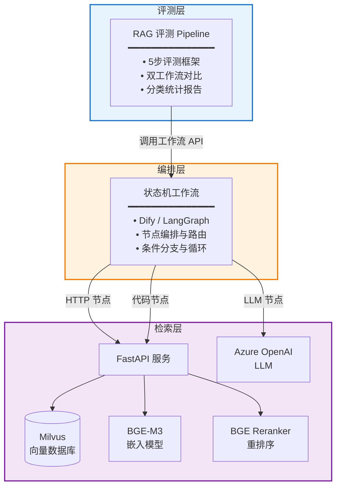
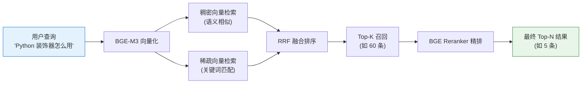
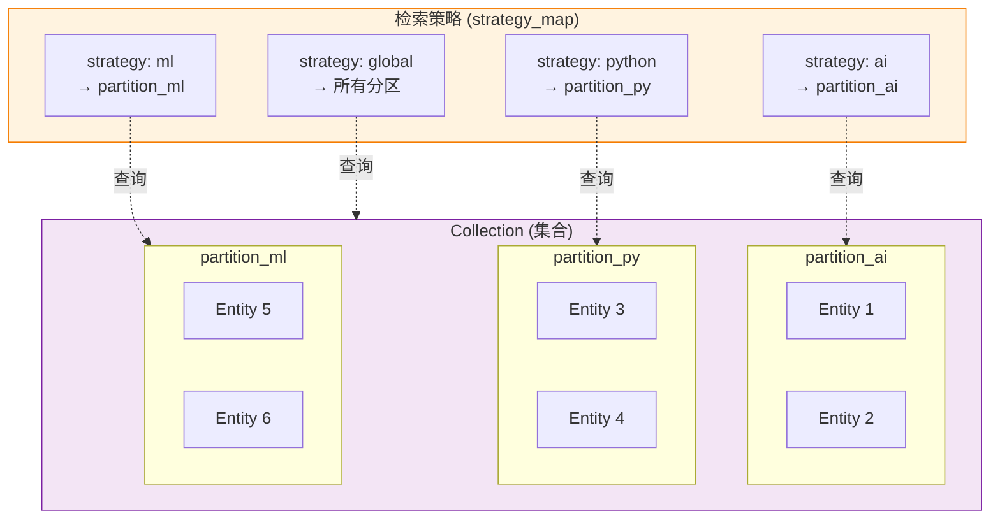
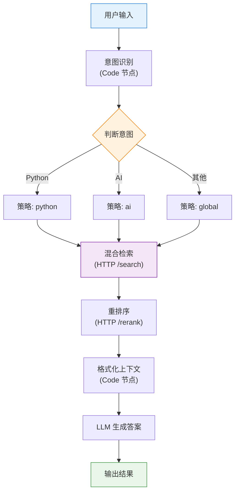
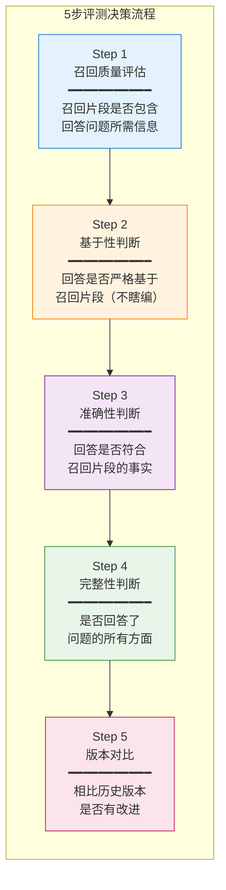
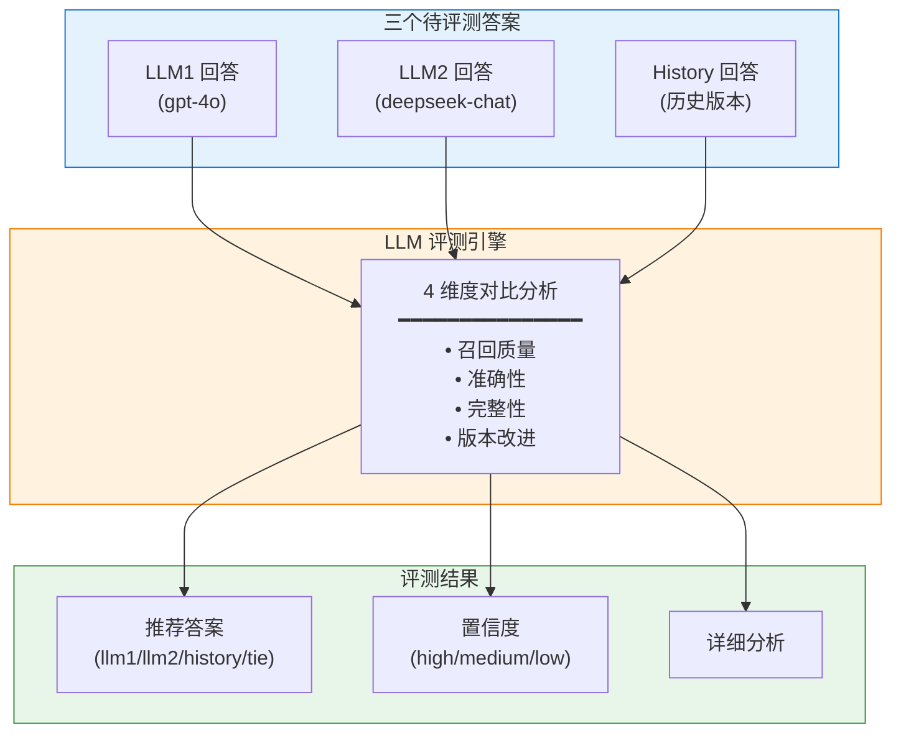

## 项目简介

本项目是一个**端到端的 RAG（Retrieval-Augmented Generation）系统**，包含向量检索引擎、状态机工作流编排和自动化评测三个核心模块。系统采用模块化设计，各组件通过 HTTP API 解耦通信，支持灵活的扩展和替换。

**核心仓库**：
- [milvus_test](https://github.com/pheonix2006/milvus_test) - 混合向量检索引擎（检索层）
- [dify-obd](https://github.com/pheonix2006/dify-obd) - RAG 评测 Pipeline（评测层）

## 系统架构



## 检索层：混合向量检索引擎

### 为什么需要混合检索？

| 检索方式 | 优点 | 缺点 |
|---------|------|------|
| 关键词检索 | 精确匹配，适合专有名词 | 无法理解语义 |
| 稠密向量 | 理解语义相似性 | 可能遗漏精确关键词 |
| 稀疏向量 | 保留关键词权重 | 计算开销大 |
| **混合检索** | **兼顾语义与关键词** | **需要融合策略** |

本项目使用 **RRF (Reciprocal Rank Fusion)** 算法融合稠密向量和稀疏向量的检索结果。

### 混合检索流程



### 核心技术组件

| 组件 | 技术选型 | 说明 |
|------|---------|------|
| 向量数据库 | Milvus 2.6 | 开源高性能向量数据库 |
| 嵌入模型 | BGE-M3 | 支持稠密+稀疏混合向量 |
| 重排序模型 | BGE Reranker v2-m3 | 精排优化召回质量 |
| 模型服务 | Xinference | 本地模型部署框架 |
| API 框架 | FastAPI | 高性能异步 REST API |

### Milvus 数据组织

Milvus 采用 **Collection → Partition → Entity** 的三级数据结构，支持灵活的分区管理和检索策略。



#### Collection（集合）

Collection 是 Milvus 中的最高层级数据容器，类似于关系数据库中的**表**。每个 Collection 存储同一类型的向量数据及其关联的标量字段。

```json
{
  "collection_name": "hybrid_rag_collection_v1"
}
```

#### Partition（分区）

Partition 是 Collection 的**子集划分**，允许将数据按业务领域逻辑分离存储。

| 特性 | 说明 |
|------|------|
| **物理隔离** | 不同 Partition 的数据在存储上隔离 |
| **检索加速** | 查询时仅扫描指定 Partition，减少无效计算 |
| **独立管理** | 可单独加载/释放，节省内存 |
| **灵活路由** | 通过策略映射实现意图路由 |

**文件到分区的映射配置**：

```json
{
  "file_to_partition_map": {
    "ai.txt": "partition_ai",
    "cpp.txt": "partition_cpp",
    "python.txt": "partition_py",
    "machine_learning.txt": "partition_ml"
  }
}
```

#### Strategy（检索策略）

检索策略定义了**查询意图到 Partition 的映射关系**，实现智能路由。

| 策略名称 | 目标分区 | 适用场景 |
|---------|---------|---------|
| `ai` | `["partition_ai"]` | AI 相关问题查询 |
| `python` | `["partition_py"]` | Python 编程问题 |
| `ml` | `["partition_ml"]` | 机器学习问题 |
| `global` | `[]` | 全局搜索，检索所有分区 |

**配置示例**：

```json
{
  "strategy_map": {
    "ai": ["partition_ai"],
    "python": ["partition_py"],
    "ml": ["partition_ml"],
    "cpp": ["partition_cpp"],
    "global": []
  }
}
```

**检索逻辑**：

1. **指定策略**（如 `strategy: "python"`）→ 仅在 `partition_py` 中检索
2. **全局策略**（`strategy: "global"` 或 `[]`）→ 在所有 Partition 中检索
3. **多分区策略**（如 `["partition_ai", "partition_ml"]`）→ 跨多个分区联合检索

### API 接口设计

检索层提供三个核心 API：

#### 1. 混合检索 `/search`

```bash
curl -X POST "http://localhost:8000/search" \
  -H "Content-Type: application/json" \
  -d '{
    "query": "什么是机器学习？",
    "top_k": 60,
    "strategy": "ml"
  }'
```

| 参数 | 说明 | 示例 |
|------|------|------|
| `query` | 用户查询文本 | `"Python 装饰器的作用"` |
| `top_k` | 召回数量 | `60` |
| `strategy` | 检索策略 | `"python"`, `"ai"`, `"global"` |

#### 2. 重排序 `/rerank`

```bash
curl -X POST "http://localhost:8000/rerank" \
  -H "Content-Type: application/json" \
  -d '{
    "query": "什么是机器学习？",
    "documents": {"pure_documents": ["文档1...", "文档2..."]},
    "top_k": 5
  }'
```

#### 3. LLM 对话 `/chat` (Azure OpenAI)

```bash
curl -X POST "http://localhost:8000/chat" \
  -H "Content-Type: application/json" \
  -d '{
    "prompt": "请用一句话介绍向量数据库。",
    "model": "gpt-4o"
  }'
```

## 编排层：状态机工作流

### 工作流设计理念

检索引擎提供的 API（`/search`、`/rerank`、`/chat`）是**原子化能力单元**，实际应用中需要通过状态机工作流将其组合成完整的业务逻辑。

本项目使用 **Dify** 作为可视化编排工具，同时也支持 **LangGraph** 等代码化编排方案。

### 工作流能力

| 能力 | 说明 | 典型节点 |
|------|------|---------|
| **HTTP 调用** | 调用外部 API 服务 | HTTP Request 节点 |
| **LLM 生成** | 调用大语言模型 | LLM 节点 |
| **条件分支** | 根据结果路由到不同路径 | IF/Else 节点 |
| **循环迭代** | 批量处理或重试逻辑 | Loop 节点 |
| **代码执行** | 自定义 Python/JavaScript 代码 | Code 节点 |
| **变量传递** | 节点间数据流转 | 变量引用 |

### 典型工作流示例



### 支持的编排工具

| 工具 | 特点 | 适用场景 |
|------|------|---------|
| **Dify** | 可视化拖拽、低代码 | 快速原型、非技术人员参与 |
| **LangGraph** | 代码定义、强类型 | 复杂逻辑、版本控制友好 |

### 工作流 DSL 导出

通过导出 DSL 文件可实现工作流的版本控制和快速部署：

| DSL 文件 | 模式 | 说明 |
|---------|------|------|
| `全量测试milvus_rag_eval.yml` | RAG 评测 | 单模型评测工作流 |
| `全量测试milvus_dual_compare.yml` | 双模型对比 | LLM1 vs LLM2 vs History |

## 评测层：RAG 评测 Pipeline

### 两种运行模式

| 模式 | 说明 | 适用场景 |
|------|------|---------|
| `rag_eval` | RAG 语义评测，5步评测框架 | 无标准答案的 RAG 系统优化 |
| `dual_workflow_compare` | 双工作流对比评测 | 对比两个模型/工作流的输出质量 |

### 5步评测决策框架

RAG 评测采用创新的 **5步评测决策框架**，完全基于召回文档片段进行事实性判断：



### 评测标准

| 维度 | 标准 | 说明 |
|------|------|------|
| **基于性** | 严格基于召回片段 | 任何超出召回范围的内容视为"瞎编" |
| **召回质量** | 充足/不足 | 先判断召回是否足够，再判断回答质量 |
| **准确性** | 符合事实 | 回答必须与召回片段一致 |
| **完整性** | 全面覆盖 | 必须回答问题的所有方面 |

### 分类体系

**2 级分类**（用于计算正确率）：
- ✅ **正确**：重要信息全覆盖，基于召回片段
- ❌ **错误**：不符合正确标准

**4 级分类**（用于详细分析）：
- `fully_correct` - 完全正确
- `partial_missing` - 部分缺失
- `large_missing` - 大量缺失
- `completely_wrong` - 完全错误

### 双工作流对比评测

支持 **三方对比评测**（LLM1 vs LLM2 vs History）：



## 技术栈

| 层级 | 技术 | 用途 |
|------|------|------|
| **语言** | Python 3.11+ | 主要开发语言 |
| **异步框架** | asyncio | 高并发处理 |
| **HTTP 客户端** | httpx | 异步 HTTP 请求 |
| **数据处理** | pandas, openpyxl | Excel 批量处理 |
| **向量数据库** | Milvus | 向量存储与检索 |
| **嵌入模型** | BGE-M3 | 混合向量化 |
| **重排序** | BGE Reranker v2-m3 | 精排优化 |
| **LLM 服务** | Azure OpenAI | 大语言模型 |
| **工作流编排** | Dify / LangGraph | 状态机编排 |
| **测试框架** | pytest | 单元测试 |

## 项目结构

```
milvus_test/                     # 检索引擎
├── src/milvus_test/
│   ├── api.py                   # FastAPI 服务接口
│   ├── unified_query.py         # 统一检索逻辑
│   └── unified_ingest.py        # 数据入库逻辑
└── tests/                       # 测试用例

dify-obd/                        # 评测 Pipeline
├── src/obd/
│   ├── client/dify_client.py    # 工作流 API 封装
│   ├── comparator/              # 评测模块
│   │   ├── semantic_judge.py    # RAG 评测器
│   │   └── dual_workflow_comparator.py
│   └── processor/               # 批处理模块
└── dify_dsl/                    # 工作流 DSL 文件
```

## 关键技术亮点

### 1. 混合向量检索
- 同时利用稠密向量（语义理解）和稀疏向量（关键词匹配）
- RRF 算法融合两种检索结果，提升召回质量

### 2. 分区路由策略
- 按 Collection → Partition 组织数据
- 通过 Strategy Map 实现查询意图路由
- 减少无效检索，提升响应速度

### 3. 状态机编排
- 通过 Dify / LangGraph 编排复杂工作流
- 支持 HTTP 调用、条件分支、循环迭代等能力
- 检索引擎 API 作为原子能力单元被组合调用

### 4. 5步评测框架
- 创新的 RAG 评测方法论
- 区分召回问题和生成问题
- 支持无标准答案场景

### 5. 模块化架构
- 各组件 HTTP 解耦，可独立部署升级
- 支持灵活的模型替换和扩展

## 相关文档

- [GitHub: milvus_test - 混合向量检索引擎](https://github.com/pheonix2006/milvus_test)
- [GitHub: dify-obd - RAG 评测 Pipeline](https://github.com/pheonix2006/dify-obd)

## 参考资料

- [Milvus 官方文档](https://milvus.io/docs)
- [BGE-M3 模型](https://huggingface.co/BAAI/bge-m3)
- [Dify 开源平台](https://github.com/langgenius/dify)
- [LangGraph](https://github.com/langchain-ai/langgraph)
- [Xinference 模型服务](https://github.com/xorbitsai/inference)
