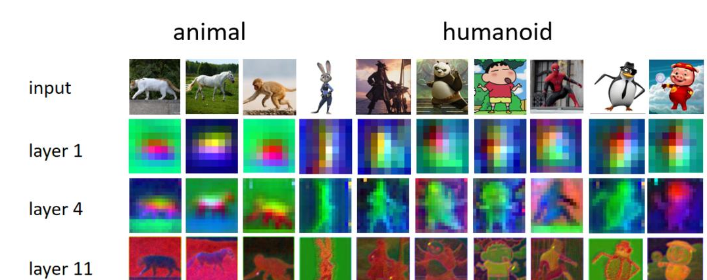
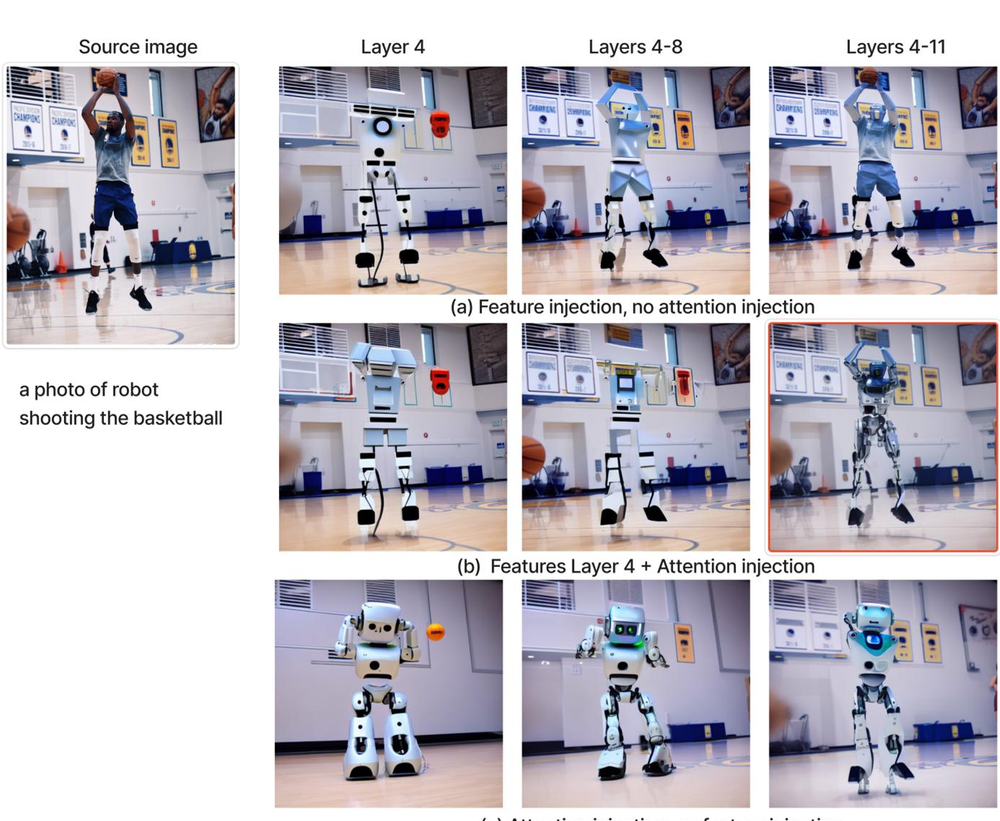
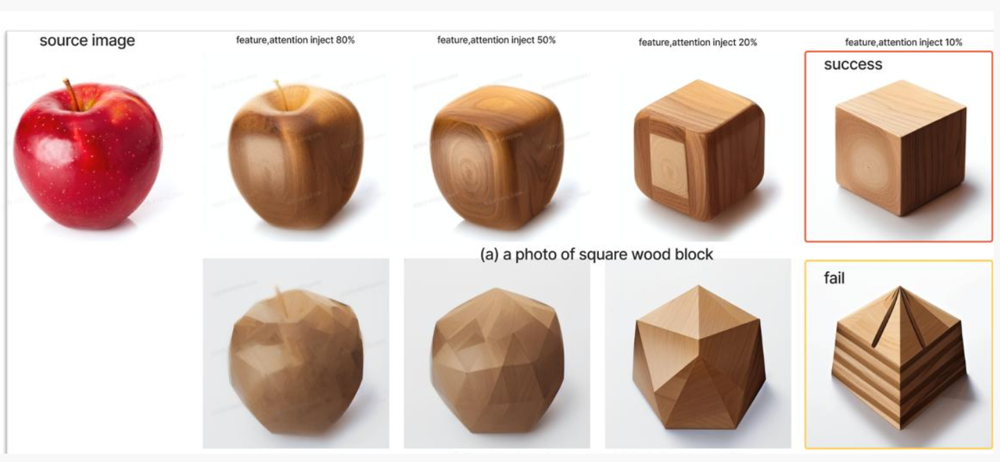
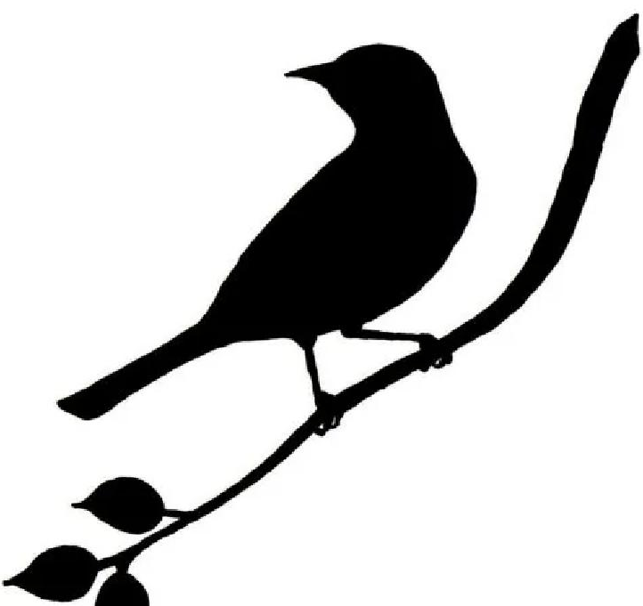
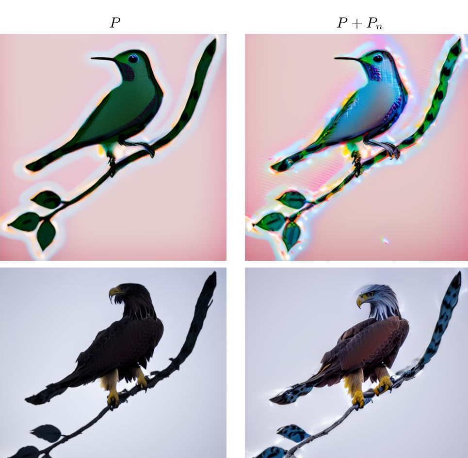

## 项目简介

本项目是对 **CVPR 2023** 论文 [Plug-and-Play Diffusion Features for Text-Driven Image-to-Image Translation](https://arxiv.org/abs/2211.12572) 的深度复现研究。不同于简单的文献综述，我们建立了严谨的实验框架，使用自定义数据集验证了论文的核心假设。

**团队成员**：Xingjian LI, Shing Yuet ZHANG, Xixi MIAO, Kam Seng LEI, Zixiang ZENG

## 研究背景

随着 Stable Diffusion 等潜在扩散模型（LDMs）的快速发展，如何精确保持生成内容的**空间结构**同时修改其**语义外观**，成为计算机视觉领域的核心挑战。

该论文提出了一种**无需训练**的推理时干预机制，通过在去噪过程中注入从引导图像提取的中间层空间特征和自注意力图，实现结构保持的图像编辑。

## 技术方法

### 双分支扩散框架

PnP 框架在推理时运行两个并行的扩散过程：

- **引导分支（Guidance Branch）**：负责"理解"原始图像的结构，通过 DDIM Inversion 获取初始噪声，在去噪过程中提取中间特征
- **生成分支（Generation Branch）**：负责绘制新的语义，使用目标提示词进行去噪，在特定层强制注入引导分支提取的特征

### 关键特征

- **空间特征图（Spatial Features）**：U-Net 解码器第 4 层编码语义布局信息
- **自注意力图（Self-Attention Maps）**：捕获对象内部的几何关系
- **时间阈值控制**：通过 φ_f 和 φ_A 参数控制特征注入的时间范围

## 结果与分析

### 实验一：U-Net 内部空间特征验证（"第4层"假设）

此实验旨在验证 U-Net 解码器第 4 层是否包含跨物种的语义信息。图 4 展示了用于验证的多样化数据集（包括动物和类人图像）以及从解码器第 1、4、11 层提取的特征图可视化结果。

**结果显示**，第 4 层特征图在不同物种和风格下表现出强烈的一致性，而第 1 层仅显示粗略布局，第 11 层则捕捉高频噪声和纹理细节。

| 层级 | 特征表现 |
|------|----------|
| Layer 1 | 极度模糊，仅前景/背景分离 |
| **Layer 4** | **跨物种语义一致性（马/猫/猴身体部位同色）** |
| Layer 11 | 高频噪声，与原始纹理高度相关 |

### 实验二：消融研究 - 特征与注意力的解耦分析

此实验旨在解构"空间特征 (f)"和"自注意力 (A)"在 PnP 框架中的独立作用。图 5 通过对比三组实验（仅特征注入、特征+注意力注入、仅注意力注入）的结果，展示了不同配置对生成图像结构保留和外观泄漏的影响。

**结果表明**，结合第 4 层特征和全层注意力注入（Group B）能取得最佳效果，在保持结构的同时实现有效的外观转换。

### 实验三：阈值敏感性与几何拓扑边界

此实验通过将苹果图像编辑为方形木块和三角形金字塔，测试 PnP 方法在几何冲突下的性能。图 6 展示了不同特征/注意力注入阈值下的编辑结果。

**实验揭示**，PnP 方法存在一个"几何编辑包络"——在包络内可以交换形状，超出该范围会导致编辑失败或产生不自然的"木苹果"效果。这表明方法对注入阈值高度敏感。

### 实验四：负向提示的作用

此实验旨在验证负向提示（P_n）在处理"无纹理原始图像"时的增强效果。图 7 是实验的源图像（一只鸟的剪影），图 8 则对比了仅使用正向提示（P）和结合正向与负向提示（P + P_n）的生成结果。

**结果显示**，负向提示能显著改善从剪影到真实感图像的转换，避免"黑鸟剪影"的出现，并增强细节和真实感。

## 结论与局限

### 核心发现

1. **有效性**：空间特征注入确实是结构保持的有效途径，解码器第 4 层表现最佳
2. **最优配置**："Layer 4 特征 + 全层自注意力"是平衡结构保持与外观编辑的最佳策略
3. **敏感性**：方法对注入阈值高度敏感，并受几何编辑包络约束

### 局限性分析

- **软解耦边界**：Layer 4 的结构/外观解耦不完美，高阈值下仍存在特征泄露
- **逆向漂移脆弱性**：DDIM Inversion 的累积误差影响编辑稳定性
- **推理成本**：双分支并行导致推理时间翻倍

## 相关文档

- [📄 查看完整项目报告 (PDF)](/files/projects/plug-and-play-report.pdf)

## 参考文献

- [论文原文 (arXiv)](https://arxiv.org/abs/2211.12572)
- [官方代码仓库](https://github.com/MichalGeyer/plug-and-play)
- [CVF Open Access](https://openaccess.thecvf.com/content/CVPR2023/papers/Tumanyan_Plug-and-Play_Diffusion_Features_for_Text-Driven_Image-to-Image_Translation_CVPR_2023_paper.pdf)
