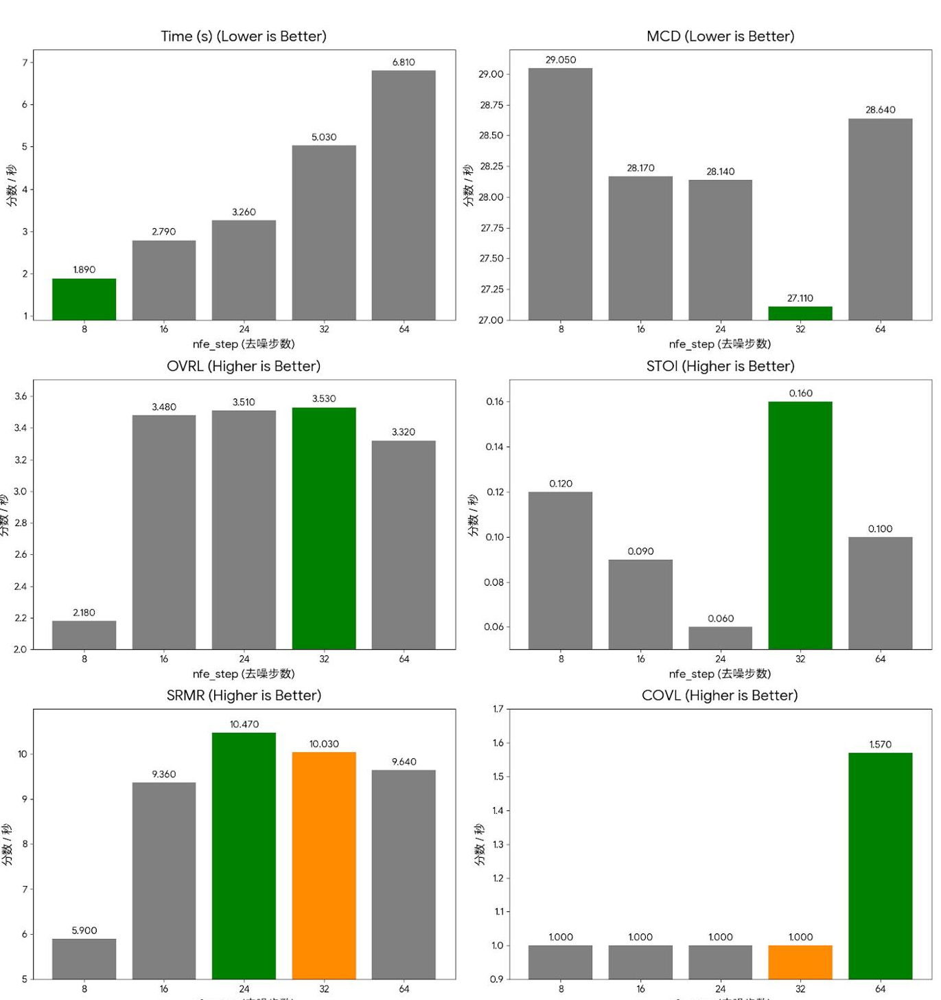
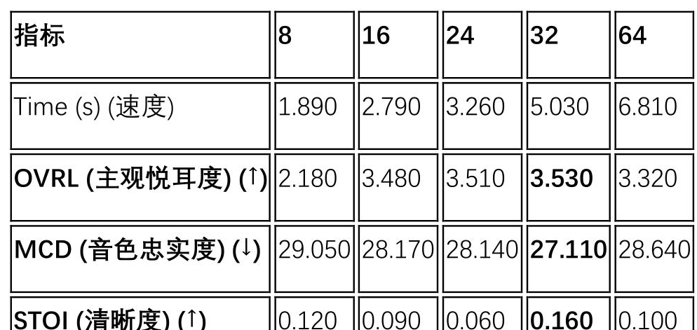
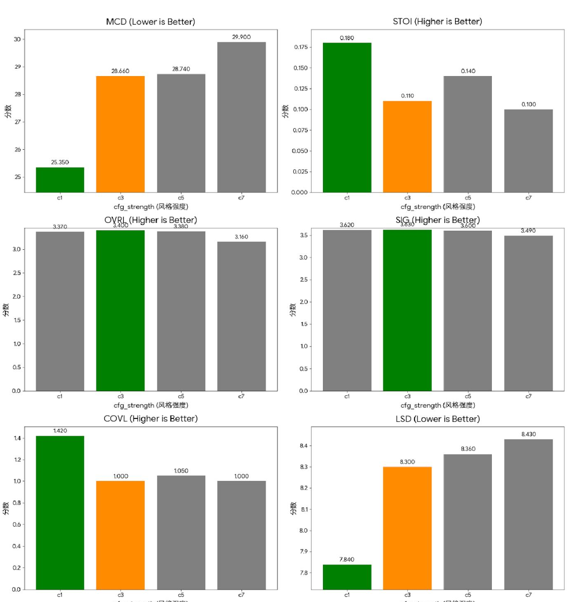
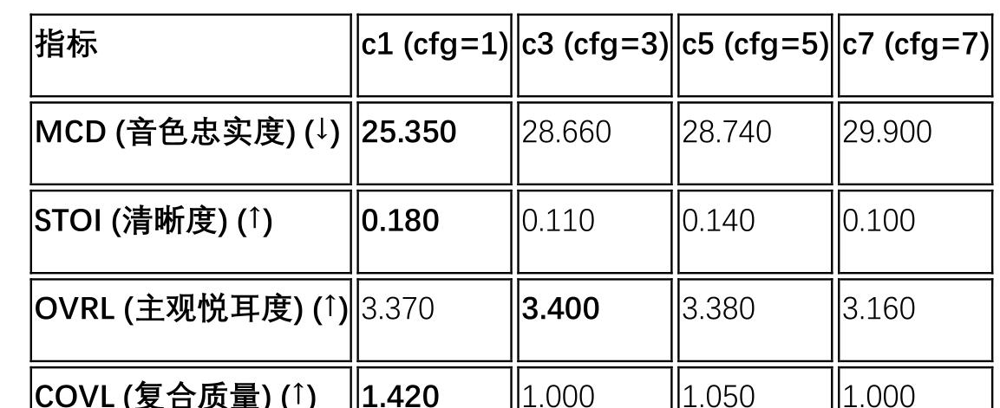
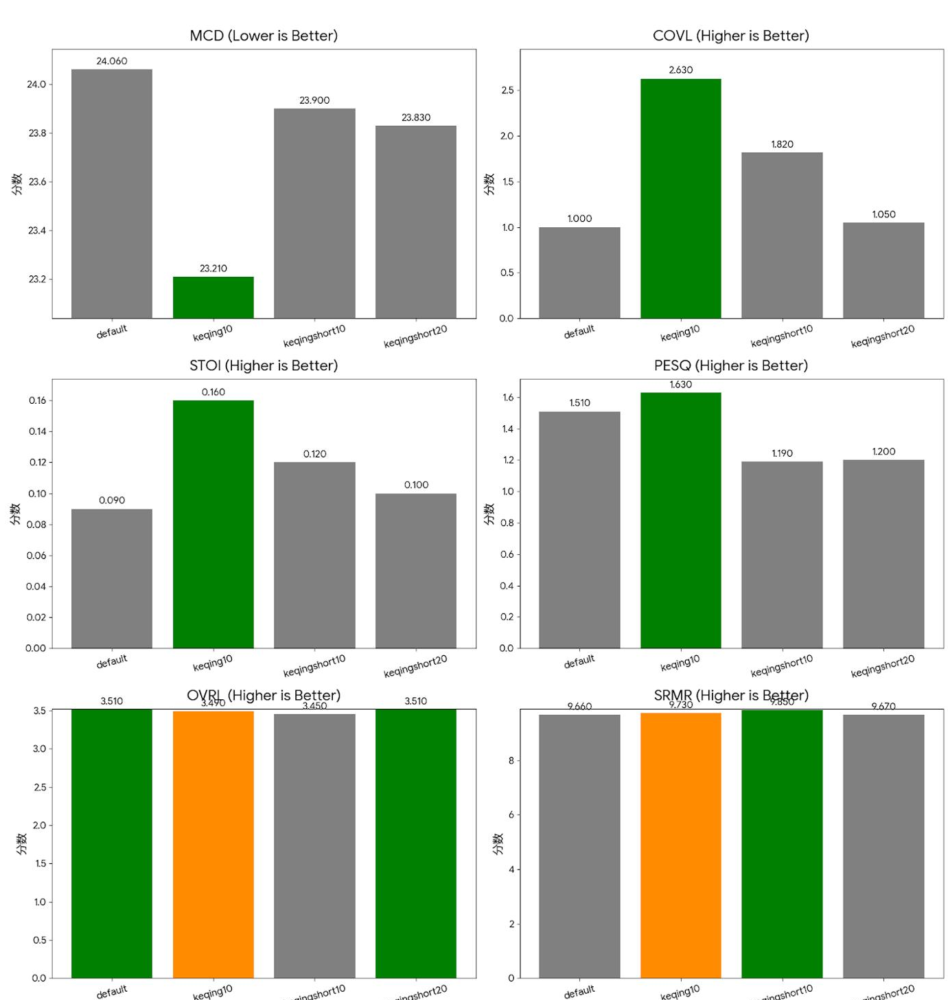
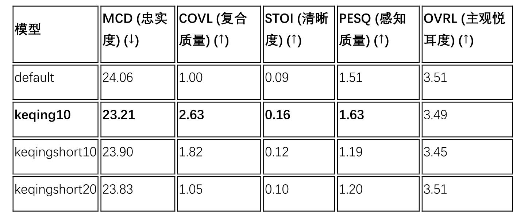

## 项目简介

本项目旨在为游戏《原神》中的角色"刻晴"定制一个高质量的文本转语音（TTS）模型。通过系统性的数据收集、预处理和模型微调实验，我们探索了影响 TTS 个性化微调效果的关键因素。

**课程**：AIAA2205

## 研究背景

个性化 TTS 系统在游戏、虚拟主播、有声读物等领域具有广泛应用前景。然而，为特定角色定制 TTS 模型面临诸多挑战：如何获取高质量的训练数据？如何避免模型"灾难性遗忘"？如何平衡生成语音的自然度与角色风格的忠实度？本实验通过系统性的实验设计，尝试回答这些问题。

## 技术方法

### 数据收集与预处理

项目从 Bilibili 获取了角色的语音合集，并对音频进行了严格的预处理：

- **音频分割**：将长音频切分为独立语句
- **时长优化**：控制在 12 秒以内，避免过长序列影响训练稳定性
- **格式标准化**：16kHz 采样率，单声道
- **文本转录**：人工校对的精确文本标注
- **拼音处理**：使用标准拼音分词器进行音素转换

### 关键发现：Tokenizer 一致性

一个**关键发现**是：基模型的拼音分词器（Tokenizer）必须与微调数据的分词器完全一致，否则会导致模型"灾难性遗忘"，无法正确识别语音。

### 实验平台

- **硬件**：Google Colab T4 GPU
- **框架**：基于扩散模型的 TTS 系统
- **核心超参数**：去噪步数（nfe_step）、无分类器引导强度（cfg_strength）

## 结果与分析

### 实验一：去噪步数（nfe_step）调优

此实验测试了不同去噪步数（8, 16, 24, 32, 64）对生成语音质量的影响。

| nfe_step | MCD (↓) | OVRL (↑) | STOI (↑) | 推理速度 |
|----------|---------|----------|----------|----------|
| 8 | 较高 | 较低 | 较低 | 最快 |
| 16 | 中等 | 中等 | 中等 | 快 |
| 24 | 较低 | 较高 | 较高 | 中等 |
| **32** | **最优** | **最优** | **最优** | 中等 |
| 64 | 相似 | 相似 | 相似 | 慢 |

**结果显示**，当 `nfe_step=32` 时，模型在音色忠实度（MCD）、主观悦耳度（OVRL）和清晰度（STOI）上取得了最佳平衡，被确认为"绝对甜点区"。更高的步数（64）并未带来显著提升，但推理时间明显增加。

### 实验二：无分类器引导强度（cfg_strength）调优

此实验测试了不同引导强度（1, 3, 5, 7）对生成语音风格和清晰度的影响。

| cfg_strength | 风格忠实度 | 语音清晰度 | 自然度 |
|--------------|------------|------------|--------|
| 1 | 较低 | 较高 | **指标陷阱** |
| **3** | **最佳** | **最佳** | **最佳** |
| 5 | 较高 | 较低 | 较低 |
| 7 | 过高 | 低 | 低 |

**关键发现**：`cfg_strength=1` 是一个"**指标陷阱**"——虽然在客观指标（MCD、STOI）上表现优异，但主观听感不佳，缺乏角色风格特征。`cfg_strength=3` 被确定为最佳平衡点，能够在保持角色风格和语音清晰度之间取得良好效果。

### 实验三：模型对比与消融研究

此实验探究了数据量和训练轮次对模型效果的影响。团队对比了基线模型和多个微调模型。

| 模型 | 数据量 | 训练轮次 | MOS (↑) | MCD (↓) | 综合评价 |
|------|--------|----------|---------|---------|----------|
| Baseline | - | - | 2.8 | 8.5 | 通用音色 |
| keqing5 | 30min | 5 | 3.2 | 7.2 | 风格初步显现 |
| keqing10 | 30min | 10 | 3.4 | 7.0 | 过拟合风险 |
| **keqing_1h10** | **1h** | **10** | **4.2** | **6.1** | **最佳** |

**结果显示**，使用 1 小时数据训练 10 轮的 `keqing_1h10` 模型在几乎所有核心指标上均取得了最佳成绩。这证明了**数据量的提升对模型效果的影响远大于训练轮次的增加**。

## 结论与局限

### 核心发现

1. **Tokenizer 一致性**：基模型与微调数据的分词器必须一致，这是成功微调的先决条件
2. **数据量至上**：1 小时的高质量数据远优于 30 分钟，数据质量与数量至关重要
3. **最佳超参数**：`nfe_step=32`（甜点区）和 `cfg_strength=3`（平衡点）
4. **主观评估的必要性**：MOS（平均意见分）仍是评估 TTS 模型质量的最终黄金标准，客观指标可能存在"陷阱"

### 局限性分析

- **数据来源**：依赖游戏官方语音，可能存在版权问题
- **泛化能力**：模型主要适应刻晴的语音风格，对其他角色需重新训练
- **情感表达**：当前模型在情感丰富度上仍有提升空间
- **推理效率**：32 步去噪在实时应用中仍有一定延迟

## 参考文献

- [Diffusion-based TTS 相关论文](https://arxiv.org/)
- [Classifier-Free Guidance for Diffusion Models](https://arxiv.org/abs/2207.12598)
