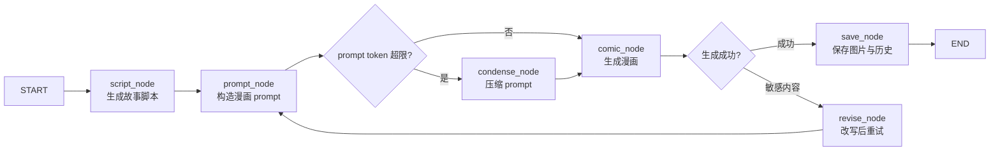

## 项目简介

**You in Parallel Universes** 是我在 **UCUG1505 Art final project** 里独立完成的作品。这门课最后我拿到了 **A**。项目的玩法很直接：观众站到摄像头前，用手势抽一个世界、确认拍照，然后系统把照片里的表情、姿态、衣服和背景当成故事线索，生成一页关于“平行宇宙里的另一个自己”的漫画。

这门课的要求很明确：作品不能依赖键盘和鼠标，要像展览里的装置一样，让观众走近以后就能参与。所以我没有把它做成一个常规网页，也没有设计复杂导航，而是把体验压到几个现场最容易理解的动作里：看摄像头、做手势、等倒计时、看生成过程，最后把作品留在 gallery 里继续展示。

最后做出来的版本主要有几块：

- 手势驱动的无键鼠交互：通过 OK、peace、open palm 完成拍照、抽主题、确认、取消和唤醒。
- 个性化漫画生成：把观众照片中的表情、姿态、服装和场景作为故事线索。
- LangGraph 多节点 AI pipeline：用 DAG 编排脚本生成、prompt 构造、压缩、图像生成、重试和保存。
- SSE 流式体验：将 theme、thinking、script、comic 分阶段推给前端，避免长时间黑盒等待。
- 节点级输入输出追踪：通过 LangSmith 和本地 JSONL trace 保留每个节点的输入、输出、reasoning 和耗时。

## 从谚语漫画到平行宇宙

项目早期方案是“用户照片 + 随机谚语 + 漫画故事”。这个方向看起来有文学性：谚语本身包含隐喻和故事张力，观众照片可以被嵌入到故事里。但实际设计时我发现它有明显的问题：

- 随机谚语不一定适合当前观众的表情、姿势或场景。
- 故事必须围绕谚语解释展开，限制了模型的创造空间。
- 漫画效果取决于“谚语是否刚好有趣”，边界条件太多。

后来我把核心约束从“解释某个谚语”改成“让 AI 根据观众当下状态生成另一个世界里的自己”。这样模型可以直接利用照片中的线索：表情、服装、动作、同行者、背景氛围，再结合主题世界生成故事。这个调整让作品从一个固定题材生成器，变成了一个更开放的身份想象装置。

这也是我在这个项目里最重要的产品判断之一：当原始概念限制了生成效果时，应该及时改变问题定义，而不是继续在错误方向上调 prompt。

## 交互流程

实际使用时，流程是这样的：

1. 观众走到摄像头前，系统进入相机准备状态。
2. 观众用 peace 手势进入主题抽取，也可以直接用 OK 手势开始拍照。
3. 主题抽取以抽卡/老虎机式动画呈现，OK 确认，peace 重抽，open palm 取消。
4. 系统进入 3 秒倒计时，抓拍当前视频帧。
5. 前端通过 SSE 接收后端生成过程：主题、thinking 文本、脚本和最终漫画。
6. 漫画完成后展示结果；无人操作一段时间后，系统进入 gallery 模式轮播历史作品。

这里我不想做一个让用户填表的网页。观众在现场停留的时间很短，所以每一步都要有反馈：相机画面上的手部骨架告诉他系统已经识别到手，进度环告诉他动作正在确认，倒计时和闪白告诉他照片已经拍下，thinking 文本和 gallery 则把等待时间变成展示的一部分。

## 系统架构

代码层面，我把它拆成前端交互和后端生成两部分：

前端管现场交互和状态切换，后端管 AI pipeline、模型调用、trace 和结果保存。这样写起来麻烦一些，但好处很明显：每一步都能单独看、单独换、单独调。

## 前端：为互动装置设计的状态机

前端使用 React、TypeScript、Vite 和 Tailwind 构建。核心不是页面路由，而是一个由 `AppState` 驱动的状态机：

- `CAMERA_READY`：摄像头准备和手势识别。
- `THEME_DRAW`：主题抽取与确认。
- `COUNTDOWN`：倒计时抓拍。
- `GENERATING`：流式展示 AI 生成过程。
- `COMIC_READY`：展示最终漫画。
- `GALLERY`：空闲时轮播历史作品。

手势识别分为两层。第一层用 MediaPipe Hands 提供的 21 个 hand landmarks 做几何规则判断，识别 OK、peace、open palm。第二层再做交互确认：500ms debounce、2s hold、300ms grace 和 1s cooldown，避免误触、短暂丢帧和重复触发。

这个设计体现了展览场景的要求：观众不一定熟悉界面，也不会精确点击按钮，所以高风险动作必须长按确认，低风险动作可以即时触发。同时，摄像头组件在多个状态中保持挂载，避免反复请求权限和重启视频流造成体验中断。

## 后端：LangGraph 多节点 AI Pipeline

后端使用 FastAPI 暴露统一的 `/api/generate` SSE 接口。这个接口不是简单调用一次模型，而是启动一个 LangGraph pipeline：

这个 DAG 里每个节点都有明确职责：

- `script_node`：根据用户照片和主题世界生成 3-6 格漫画脚本。
- `prompt_node`：把故事脚本、主题视觉风格和布局规则组合成图像生成 prompt。
- `condense_node`：当 prompt 超过 token budget 时，进行压缩或截断。
- `comic_node`：调用图像生成 provider，支持图生图和重试。
- `revise_node`：遇到敏感内容拦截时改写 prompt 并重试。
- `save_node`：保存漫画、缩略图和历史记录。

前端通过 SSE 接收 `theme -> thinking -> script -> comic -> done/error`。这让用户可以看到生成过程中的中间状态，而不是面对一个不确定的 loading spinner。

## 可观测性：AI 系统不能是黑盒

这个项目里我最看重的不是某个单点实现，而是 AI pipeline 的架构方式。

在多节点 AI 系统里，如果没有节点级输入输出、日志和 trace，整个系统就会变成黑盒：模型看起来“写得不错”，但一运行就暴露大量问题；开发者只能充当人工反馈器，不断测试、报错、再让模型修改。这样的迭代效率很低，也无法稳定定位问题。

因此我在这个项目里把可观测性作为基础能力设计：

- 每个节点保留输入、输出、reasoning、时间戳和耗时。
- 通过 LangSmith 接入外部 tracing。
- 通过本地 JSONL trace 保留可离线分析的运行记录。
- 在 API 层保留 request id、慢请求日志和错误分类。
- 用测试覆盖 pipeline contract、provider factory、prompt 节点、history、trace store 等关键模块。

我的理解是：AI Agent 或多节点 DAG 开发，必须先建立 feedback loop。只有能看清每个节点发生了什么，模型和开发者才有办法调试、复盘和迭代。否则所谓“让 AI 写代码”只是把问题延后到了人工验收阶段。

## Provider 抽象与生成策略

项目中 LLM 使用 OpenAI-compatible chat completions，默认通过 OpenRouter 接入模型；图像生成层抽象为 provider factory，支持 Replicate、DashScope 和 OpenRouter image provider。这样做的原因是生成式项目非常依赖外部模型能力、成本、速度和稳定性，不能把系统写死在单一 provider 上。

主题系统也被抽象成 `ThemePack`：每个主题包含世界设定、视觉风格、图标和颜色。当前代码中有 17 个主题定义。公开介绍时我会更倾向把它们描述成“奇幻狩猎、魔法校园、赛博城市、复古游戏、东方水墨、太空歌剧”等泛化主题，而不是强调具体商业 IP 名称。

## 测试与工程边界

这个项目保留了较完整的测试资产：

- 后端 unit tests 覆盖 schema、配置、prompt、节点、provider、storage、trace 等模块。
- 后端 integration tests 覆盖 pipeline contract、trace 集成和图生成流程。
- live smoke tests 使用显式开关，避免默认调用真实外部 API。
- 前端 Vitest 覆盖手势算法、gesture confirmation、组件状态和 API 层。
- Playwright E2E 用于核心交互路径验证。

同时，这个项目也有清晰的后续改进空间。README 与实际端口配置存在漂移；当前仓库没有 CI/CD、Docker 或公网部署配置；展览现场的隐私告知、数据删除、第三方模型处理边界也需要在正式公开部署前补齐。这些不是我想掩盖的问题，而是生成式互动系统从课程作品走向生产应用时必须补上的工程边界。

## 结果与反思

这个项目最终作为 UCUG1505 Art final project 完成，并获得课程 **A**。从效果上看，开放式“平行宇宙”叙事比早期谚语方案更适合生成式 AI：模型可以根据用户的真实照片线索生成更自然、更有趣的故事，而不是被固定文本题材限制住。

这个项目对我最大的价值有三点：

1. **产品判断**：当原始谚语方案效果受限时，及时改变问题定义，转向更适合 AI 发挥的开放叙事。
2. **交互设计**：围绕艺术展示课的无键鼠要求，设计手势、倒计时、流式反馈和 gallery 的现场体验。
3. **AI 工程架构**：用 LangGraph、SSE、provider abstraction 和 trace，把生成式系统从黑盒调用拆成可观察、可调试、可迭代的多节点 pipeline。

项目从概念设计、方向调整、前后端实现、LangGraph pipeline、prompt 调试、模型接入、测试到现场调试，均由我独立完成。

## 链接

- [GitHub Repository](https://github.com/pheonix2006/You-in-parallel-universes)
- [Bilibili Demo](https://www.bilibili.com/video/BV1JFLV6yEEF/)
