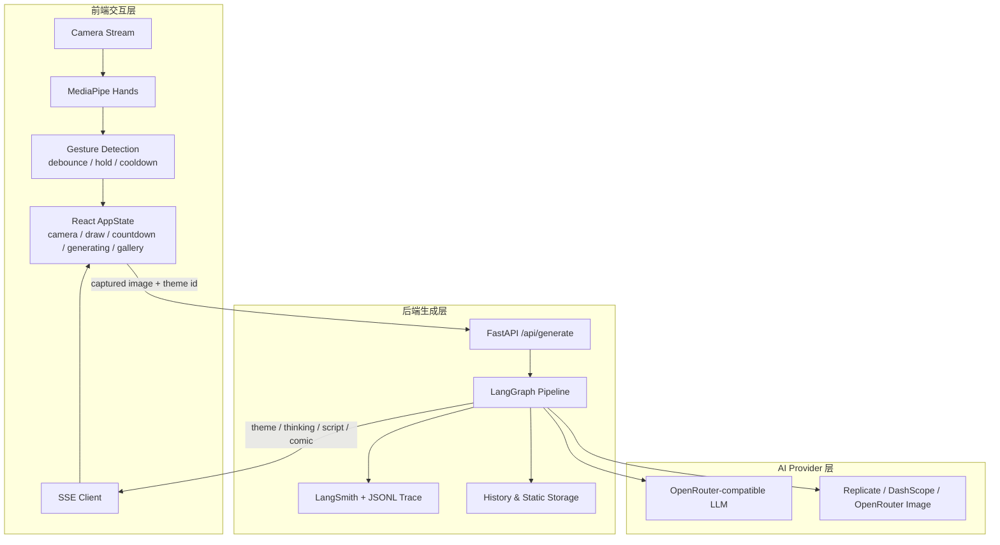
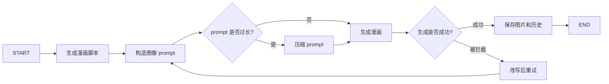

## 项目是什么

You in Parallel Universes 是我在 UCUG1505 Art final project 里做的一件 AI 互动装置。课程最后成绩是 A。

观众站到摄像头前，不需要键盘，也不需要鼠标，只用几个手势就能完成一次体验：抽取一个视觉世界，确认拍照，等待系统生成故事和漫画。最后出现的不是一张普通自拍，而是一页关于“平行宇宙里的另一个自己”的多格漫画。模型会把照片里的表情、姿态、衣服和背景都当成线索，写出一个短故事，再把它画出来。

这个项目从概念设计、前后端实现、LangGraph pipeline、prompt 调试、模型接入、测试到现场调试，都是我一个人完成的。

## 为什么要做成这样

这门课是艺术展示课，作品要面向现场观众，而不是面向坐在电脑前慢慢操作的用户。课程要求里还有一个很重要的限制：不能依赖键盘、鼠标这类常规输入。这个限制反而决定了项目的形态。

如果把它做成普通网页，观众要读说明、点按钮、上传照片，体验会很像一个工具。但展览现场的参与方式应该更直接：人走到装置前，系统能看见他；他做一个手势，系统就给出反馈；拍照、生成、展示都在同一个空间里完成。

所以我把交互压缩成一条很短的路径：摄像头画面、手势确认、倒计时、流式生成、gallery 轮播。读者可以把它理解成一个“站在屏幕前就能玩的 AI 漫画拍照亭”，只是后面的生成流程比普通拍照亭复杂得多。

## 我中途改掉了原方案

最早的想法不是“平行宇宙”。我一开始想做的是“用户照片 + 随机谚语 + 漫画故事”：谚语里通常有隐喻和情节，听起来很适合拿来生成漫画。

但做了一段时间后，我发现这个方向不太对。随机谚语不一定适合当前观众。比如一个人的表情、动作、衣服、背景都很有特点，但谚语本身如果没有给模型留下足够空间，生成结果反而会被限制住。故事要先解释谚语，再把用户塞进去，很多时候像是在硬凑。

后来我把问题改成：不要求模型解释一个固定文本，而是让它从观众当下的状态出发，想象“另一个世界里的这个人”。这样照片本身就变成了故事的入口。有人穿得正式，模型可以把他写成星际会议里的代表；有人表情夸张，模型可以把这个表情变成漫画冲突；背景里有同伴，也可以进入故事。

这个改动对最终效果影响很大。它不是简单换了一个主题名，而是把项目从“围绕谚语做生成”改成了“围绕观众本人做生成”。

## 一次完整体验

现场使用时，流程大概是这样：

1. 观众走到摄像头前，页面进入相机状态。
2. 系统识别手势。peace 可以进入主题抽取，OK 可以确认，open palm 可以取消或唤醒。
3. 主题抽取用类似抽卡的动画呈现，观众可以确认，也可以重新抽。
4. 确认后进入 3 秒倒计时，前端抓拍当前画面。
5. 后端开始生成，前端通过 SSE 逐步显示主题、思考文本、脚本和漫画结果。
6. 漫画完成后进入展示页；一段时间无人操作后，系统会进入 gallery，轮播历史作品。

这里最容易被忽略的是反馈。手势交互不像鼠标点击那么确定，观众也不一定知道系统有没有看懂自己。所以我加了手部骨架覆盖、进度环、倒计时闪白、生成中的文本提示和 gallery。它们不是装饰，而是在告诉观众：系统看到你了、动作正在确认、照片已经拍下、故事正在生成、生成结果会留在现场继续展示。

## 系统怎么拆

代码上我把项目拆成前端交互层、后端生成层和模型 provider 层。前端负责摄像头、手势识别和页面状态；后端负责启动生成流程、调用模型、记录 trace 和保存结果；provider 层把不同模型服务包起来，避免整个系统绑死在一个图像生成接口上。

这个拆法的好处是，每一层的问题都能分开看。前端手势误触，不应该和模型生成失败混在一起；图像 provider 不稳定，也不应该影响主题抽取和前端状态机的逻辑。

## 前端：把手势做成可用的交互

前端用 React、TypeScript、Vite 和 Tailwind 写。它的核心不是页面路由，而是状态机：相机准备、主题抽取、倒计时、生成中、漫画完成、gallery。摄像头组件在这些状态之间尽量保持挂载，避免反复请求权限和重启视频流。

手势识别分两层。第一层用 MediaPipe Hands 的 21 个手部关键点做几何判断，识别 OK、peace 和 open palm。第二层才是交互确认：debounce 用来过滤短暂误判，hold 用来要求用户持续做出高风险动作，grace 用来处理短暂丢帧，cooldown 用来避免一个动作连续触发多次。

这部分看起来像调参数，但它决定了作品能不能在现场使用。如果观众稍微抖一下手就拍照，体验会很糟；如果每个动作都要等太久，大家又会觉得系统没有反应。所以我把不同动作区分开：确认拍照这类操作更保守，抽主题和取消这类操作可以更轻一些。

## 后端：不是只调一次模型

后端用 FastAPI 暴露 `/api/generate`，前端通过 SSE 接收生成进度。这里没有把逻辑写成“一次请求一个大 prompt”，而是用 LangGraph 拆成多个节点。

实际流程里，脚本生成、prompt 构造、prompt 压缩、图像生成、失败改写和结果保存都有独立节点。前端看到的 theme、thinking、script、comic、done/error 这些事件，也是从这条流程里逐步发出来的。

我这么做不是为了把架构画复杂，而是为了调试。生成式项目的问题经常不在最后一步：可能是照片信息没有被脚本用上，可能是脚本很好但 prompt 太长，可能是图像 provider 拦截了某个词，也可能是结果保存失败。如果所有逻辑都塞进一个函数，出错时只能猜。拆成节点后，每一步的输入、输出和耗时都能单独回看。

## 我最重视的是可观测性

这个项目里，我最在意的不是“能不能调用模型”，而是 AI pipeline 出问题时能不能知道问题在哪里。

多节点生成系统如果没有 trace，很快就会变成黑盒。模型看起来输出得不错，但真正跑起来会出现很多小问题：某个节点忘了传字段，某次生成结果没有保存，某个 provider 返回了不稳定的错误，或者 prompt 被改到后面已经偏离了最初目标。没有记录的话，人只能反复充当反馈器：跑一次，发现问题，描述给模型，再让模型改。

所以我在后端保留了节点级记录：每个节点的输入、输出、reasoning、时间戳和耗时都会被写下来。外部可以接 LangSmith，本地也有 JSONL trace，方便离线检查。API 层也保留 request id、慢请求日志和错误分类。

这和我后来做 Agent / 多节点 DAG 的经验是一致的：先建立 feedback loop，再谈自动化迭代。系统必须能告诉开发者“哪一步出了什么问题”，否则 AI 写再多代码，最后还是要靠人肉验收来补反馈。

## 模型接入和主题系统

LLM 侧使用 OpenAI-compatible chat completions，默认通过 OpenRouter 接入；图像生成侧做了 provider factory，支持 Replicate、DashScope 和 OpenRouter image provider。生成式项目很容易受模型能力、价格、速度和稳定性影响，所以我不想把项目写死在一个服务上。

主题系统被抽象成 ThemePack。每个主题包含世界设定、视觉风格、图标和颜色。仓库里有 17 个主题定义。对外介绍时，我更倾向于把它们描述成“奇幻狩猎、魔法校园、赛博城市、复古游戏、东方水墨、太空歌剧”这类泛化主题，而不是强调具体商业 IP 名称。

## 测试和边界

这个仓库里保留了比较完整的测试资产。后端有 unit tests 覆盖 schema、配置、prompt、节点、provider、storage 和 trace；也有 integration tests 覆盖 pipeline contract、trace 集成和图像生成流程。真实外部 API 的 smoke test 做了显式开关，避免默认运行时产生调用成本。前端用 Vitest 测手势算法、gesture confirmation、组件状态和 API 层，Playwright 用来覆盖核心交互路径。

它也还有一些没有包装好的地方。README 和实际端口配置有过漂移；仓库当前没有 CI/CD、Docker 或公网部署配置；如果要把它从课程作品变成公开长期运行的系统，还需要补隐私告知、数据删除、第三方模型处理边界等内容。

这些限制我不会在作品介绍里藏起来。它已经完成了课程展示所需的闭环，但还不是一个可以直接长期上线的产品。

## 结果和我带走的经验

项目最终作为 UCUG1505 Art final project 完成，课程成绩是 A。对我来说，最重要的收获有三个。

第一是产品判断。原来的谚语方案不是完全不能做，但它把模型限制在一个不自然的问题里。改成“平行宇宙里的另一个自己”后，照片里的真实线索终于能变成故事的一部分。

第二是交互设计。艺术展示里的用户不会像使用后台系统那样耐心操作，所以手势、倒计时、流式反馈和 gallery 都要服务于现场体验。

第三是 AI 工程架构。这个项目让我更明确地意识到，多节点 AI 系统不能只看最后输出。LangGraph、SSE、provider abstraction 和 trace 这些东西放在一起，才让一个生成流程变得可观察、可调试、可替换。

## 链接

- [GitHub Repository](https://github.com/pheonix2006/You-in-parallel-universes)
- [Bilibili Demo](https://www.bilibili.com/video/BV1JFLV6yEEF/)
